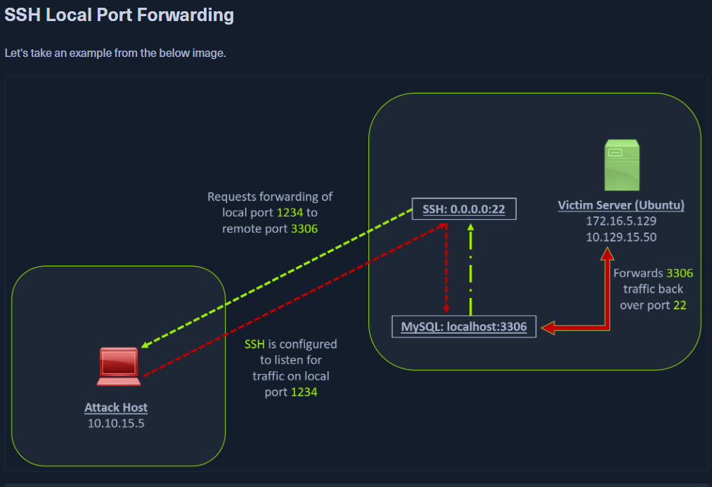

[[Apuntes]]
Port forwarding es una técnica que nos permite redirigir una solicitud de comunicación desde un puerto hacia otro. Esta técnica utiliza TCP como la capa principal de comunicación para proporcionar interacción en el puerto redirigido. Sin embargo, es posible usar diferentes protocolos de capa de aplicación como SSH, o incluso SOCKS (que no pertenece a la capa de aplicación), para encapsular el tráfico redirigido. Esto puede ser útil para sortear firewalls y aprovechar servicios existentes en un host comprometido para moverse hacia otras redes.



## Escaneo objetivo a pivotar
``
```bash
DanielGCab@htb[/htb]$ nmap -sT -p22,3306 10.129.202.64

Starting Nmap 7.92 ( https://nmap.org ) at 2022-02-24 12:12 EST
Nmap scan report for 10.129.202.64
Host is up (0.12s latency).

PORT     STATE  SERVICE
22/tcp   open   ssh
3306/tcp closed mysql

Nmap done: 1 IP address (1 host up) scanned in 0.68 seconds
```

El resultado de Nmap muestra que el puerto de SSH está abierto. Para acceder al servicio MySQL, podemos optar por conectarnos al servidor a través de SSH y acceder a MySQL desde dentro del servidor Ubuntu, o bien, podemos hacer port forwarding hacia nuestro localhost en el puerto 1234 y accederlo localmente. Un beneficio de accederlo localmente es que, si queremos ejecutar un exploit remoto en el servicio MySQL, no podríamos hacerlo sin port forwarding. Esto se debe a que MySQL se aloja localmente en el servidor Ubuntu en el puerto 3306. Por lo tanto, utilizaremos el siguiente comando para redirigir nuestro puerto local (1234) a través de SSH hacia el servidor Ubuntu.

## Ejecutar por forwarding ssh

```bash
DanielGCab@htb[/htb]$ ssh -L 1234:localhost:3306 ubuntu@[IPTARGET]

ubuntu@10.129.202.64s password: 
Welcome to Ubuntu 20.04.3 LTS (GNU/Linux 5.4.0-91-generic x86_64)

 * Documentation:  https://help.ubuntu.com
 * Management:     https://landscape.canonical.com
 * Support:        https://ubuntu.com/advantage

  System information as of Thu 24 Feb 2022 05:23:20 PM UTC

  System load:             0.0
  Usage of /:              28.4% of 13.72GB
  Memory usage:            34%
  Swap usage:              0%
  Processes:               175
  Users logged in:         1
  IPv4 address for ens192: 10.129.202.64
  IPv6 address for ens192: dead:beef::250:56ff:feb9:52eb
  IPv4 address for ens224: 172.16.5.129

 * Super-optimized for small spaces - read how we shrank the memory
   footprint of MicroK8s to make it the smallest full K8s around.

   https://ubuntu.com/blog/microk8s-memory-optimisation

66 updates can be applied immediately.
45 of these updates are standard security updates.
To see these additional updates run: apt list --upgradable
```

Este comando establece una conexión SSH a la máquina remota `10.129.202.64` con el usuario `ubuntu` y, al mismo tiempo, crea un túnel SSH que redirige las conexiones locales en el puerto `1234` de tu máquina hacia el puerto `3306` de la máquina remota.

#### Confirmar Port Forward con Netstat

```bash
DanielGCab@htb[/htb]$ netstat -antp | grep 1234

(Not all processes could be identified, non-owned process info
 will not be shown, you would have to be root to see it all.)
tcp        0      0 127.0.0.1:1234          0.0.0.0:*               LISTEN      4034/ssh            
tcp6       0      0 ::1:1234                :::*                    LISTEN      4034/ssh   
```

#### Confirmar Port Forward con Nmap

```bash
DanielGCab@htb[/htb]$ nmap -v -sV -p1234 localhost

Starting Nmap 7.92 ( https://nmap.org ) at 2022-02-24 12:18 EST
NSE: Loaded 45 scripts for scanning.
Initiating Ping Scan at 12:18
Scanning localhost (127.0.0.1) [2 ports]
Completed Ping Scan at 12:18, 0.01s elapsed (1 total hosts)
Initiating Connect Scan at 12:18
Scanning localhost (127.0.0.1) [1 port]
Discovered open port 1234/tcp on 127.0.0.1
Completed Connect Scan at 12:18, 0.01s elapsed (1 total ports)
Initiating Service scan at 12:18
Scanning 1 service on localhost (127.0.0.1)
Completed Service scan at 12:18, 0.12s elapsed (1 service on 1 host)
NSE: Script scanning 127.0.0.1.
Initiating NSE at 12:18
Completed NSE at 12:18, 0.01s elapsed
Initiating NSE at 12:18
Completed NSE at 12:18, 0.00s elapsed
Nmap scan report for localhost (127.0.0.1)
Host is up (0.0080s latency).
Other addresses for localhost (not scanned): ::1

PORT     STATE SERVICE VERSION
1234/tcp open  mysql   MySQL 8.0.28-0ubuntu0.20.04.3

Read data files from: /usr/bin/../share/nmap
Service detection performed. Please report any incorrect results at https://nmap.org/submit/ .
Nmap done: 1 IP address (1 host up) scanned in 1.18 seconds
```

#### Forwarding Multiple Puertos

```bash
DanielGCab@htb[/htb]$ ssh -L 1234:localhost:3306 -L 8080:localhost:80 ubuntu@10.129.202.64
```

#### SOCKS con SSH

SOCKS, que significa Socket Secure, es un protocolo que facilita la comunicación con servidores en situaciones donde existen restricciones de firewall. A diferencia de la mayoría de los casos en los que inicias una conexión para acceder a un servicio, en el caso de SOCKS, el tráfico inicial es generado por un cliente SOCKS, que se conecta al servidor SOCKS controlado por el usuario que desea acceder a un servicio en el lado del cliente. Una vez establecida la conexión, el tráfico de red puede ser dirigido a través del servidor SOCKS en nombre del cliente conectado.

Esta técnica se utiliza a menudo para eludir las restricciones impuestas por firewalls, permitiendo que una entidad externa bypass el firewall y acceda a un servicio dentro del entorno protegido. Otro beneficio de usar un proxy SOCKS para pivotar y reenviar datos es que los proxies SOCKS pueden crear una ruta hacia un servidor externo desde redes NAT. Actualmente, existen dos tipos de proxies SOCKS: SOCKS4 y SOCKS5. SOCKS4 no ofrece autenticación ni soporte para UDP, mientras que SOCKS5 sí proporciona estas características. Vamos a considerar un ejemplo con la imagen a continuación, donde tenemos una red NAT con el rango 172.16.5.0/23, a la cual no podemos acceder directamente.


En la imagen mencionada, el host atacante inicia el cliente SSH y solicita al servidor SSH que le permita enviar datos TCP a través del socket SSH. El servidor SSH responde con un acuse de recibo, y luego el cliente SSH comienza a escuchar en `localhost:9050`. Cualquier dato que envíes a este puerto será retransmitido a toda la red `172.16.5.0/23` a través de SSH. Podemos usar el siguiente comando para realizar este port forwarding dinámico.

#### Habilitar Dynamic Port Forwarding con SSH

```bash
DanielGCab@htb[/htb]$ ssh -D 9050 ubuntu@10.129.202.64
```

El argumento `-D` solicita al servidor SSH que habilite el **dynamic port forwarding**. Una vez habilitado, necesitaremos una herramienta que pueda redirigir los paquetes de cualquier aplicación a través del puerto `9050`. Podemos hacer esto utilizando la herramienta **proxychains**, que es capaz de redirigir conexiones TCP a través de proxies como **TOR**, **SOCKS** y **HTTP/HTTPS**, y también permite encadenar varios servidores proxy. Usando **proxychains**, podemos ocultar la dirección IP del host que hace la solicitud, ya que el host receptor solo verá la IP del host de pivote. **Proxychains** se usa frecuentemente para forzar el tráfico TCP de una aplicación a pasar por proxies hospedados como SOCKS4/SOCKS5, TOR, o proxies HTTP/HTTPS.

Para informar a **proxychains** que debe usar el puerto `9050`, debemos modificar el archivo de configuración de **proxychains** ubicado en `/etc/proxychains.conf`. Podemos agregar `socks4 127.0.0.1 9050` en la última línea si aún no está allí.

#### Comprobando /etc/proxychains.conf

```bash
DanielGCab@htb[/htb]$ tail -4 /etc/proxychains.conf

# meanwile
# defaults set to "tor"
socks4 	127.0.0.1 9050
```

Ahora, cuando inicies Nmap con **proxychains** utilizando el siguiente comando, todo el tráfico de Nmap se redirigirá al puerto local `9050`, donde nuestro cliente SSH está escuchando. Este, a su vez, reenviará todos los paquetes a través de SSH a la red `172.16.5.0/23`.

#### Usando Nmap con Proxychains

```bash
DanielGCab@htb[/htb]$ proxychains nmap -v -sn 172.16.5.1-200

ProxyChains-3.1 (http://proxychains.sf.net)

Starting Nmap 7.92 ( https://nmap.org ) at 2022-02-24 12:30 EST
Initiating Ping Scan at 12:30
Scanning 10 hosts [2 ports/host]
|S-chain|-<>-127.0.0.1:9050-<><>-172.16.5.2:80-<--timeout
|S-chain|-<>-127.0.0.1:9050-<><>-172.16.5.5:80-<><>-OK
|S-chain|-<>-127.0.0.1:9050-<><>-172.16.5.6:80-<--timeout
RTTVAR has grown to over 2.3 seconds, decreasing to 2.0

<SNIP>
```

- **Túnel SOCKS**: Usamos **proxychains** para redirigir el tráfico de Nmap a través de un túnel SOCKS.
- **Escaneo TCP Completo**: Solo se pueden realizar escaneos TCP completos, no parciales.
- **Limitaciones con Windows**: Las comprobaciones de "host-alive" pueden fallar en Windows debido al bloqueo de pings por parte del firewall.
- **Enfoque en Hosts Activos**: Es más eficiente escanear hosts individuales o rangos pequeños.

#### Enumeración de Windows a través de Proxychains

```bash
DanielGCab@htb[/htb]$ proxychains nmap -v -Pn -sT 172.16.5.19

ProxyChains-3.1 (http://proxychains.sf.net)
Host discovery disabled (-Pn). All addresses will be marked 'up' and scan times may be slower.
Starting Nmap 7.92 ( https://nmap.org ) at 2022-02-24 12:33 EST
Initiating Parallel DNS resolution of 1 host. at 12:33
Completed Parallel DNS resolution of 1 host. at 12:33, 0.15s elapsed
Initiating Connect Scan at 12:33
Scanning 172.16.5.19 [1000 ports]
|S-chain|-<>-127.0.0.1:9050-<><>-172.16.5.19:1720-<--timeout
|S-chain|-<>-127.0.0.1:9050-<><>-172.16.5.19-<--timeout
|S-chain|-<>-127.0.0.1:9050-<><>-172.16.5.19:587-<--timeout
|S-chain|-<>-127.0.0.1:9050-<><>-172.16.5.19:445-<><>-OK
Discovered open port 445/tcp on 172.16.5.19
|S-chain|-<>-127.0.0.1:9050-<><>-172.16.5.19:8080-<--timeout
|S-chain|-<>-127.0.0.1:9050-<><>-172.16.5.19:23-<--timeout
|S-chain|-<>-127.0.0.1:9050-<><>-172.16.5.19:135-<><>-OK
Discovered open port 135/tcp on 172.16.5.19
|S-chain|-<>-127.0.0.1:9050-<><>-172.16.5.19:110-<--timeout
|S-chain|-<>-127.0.0.1:9050-<><>-172.16.5.19:21-<--timeout
|S-chain|-<>-127.0.0.1:9050-<><>-172.16.5.19:554-<--timeout
|S-chain|-<>-127.0.0.1:9050-<><>-1172.16.5.19:25-<--timeout
|S-chain|-<>-127.0.0.1:9050-<><>-172.16.5.19:5900-<--timeout
|S-chain|-<>-127.0.0.1:9050-<><>-172.16.5.19:1025-<--timeout
|S-chain|-<>-127.0.0.1:9050-<><>-172.16.5.19:143-<--timeout
|S-chain|-<>-127.0.0.1:9050-<><>-172.16.5.19:199-<--timeout
|S-chain|-<>-127.0.0.1:9050-<><>-172.16.5.19:993-<--timeout
|S-chain|-<>-127.0.0.1:9050-<><>-172.16.5.19:995-<--timeout
|S-chain|-<>-127.0.0.1:9050-<><>-172.16.5.19:3389-<><>-OK
Discovered open port 3389/tcp on 172.16.5.19
|S-chain|-<>-127.0.0.1:9050-<><>-172.16.5.19:443-<--timeout
|S-chain|-<>-127.0.0.1:9050-<><>-172.16.5.19:80-<--timeout
|S-chain|-<>-127.0.0.1:9050-<><>-172.16.5.19:113-<--timeout
|S-chain|-<>-127.0.0.1:9050-<><>-172.16.5.19:8888-<--timeout
|S-chain|-<>-127.0.0.1:9050-<><>-172.16.5.19:139-<><>-OK
Discovered open port 139/tcp on 172.16.5.19
```

##  Metasploit con Proxychains

```bash
DanielGCab@htb[/htb]$ proxychains msfconsole

ProxyChains-3.1 (http://proxychains.sf.net)
                                                  

     .~+P``````-o+:.                                      -o+:.
.+oooyysyyssyyssyddh++os-`````                        ```````````````          `
+++++++++++++++++++++++sydhyoyso/:.````...`...-///::+ohhyosyyosyy/+om++:ooo///o
++++///////~~~~///////++++++++++++++++ooyysoyysosso+++++++++++++++++++///oossosy
--.`                 .-.-...-////+++++++++++++++////////~~//////++++++++++++///
                                `...............`              `...-/////...`


                                  .::::::::::-.                     .::::::-
                                .hmMMMMMMMMMMNddds\...//M\\.../hddddmMMMMMMNo
                                 :Nm-/NMMMMMMMMMMMMM$$NMMMMm&&MMMMMMMMMMMMMMy
                                 .sm/`-yMMMMMMMMMMMM$$MMMMMN&&MMMMMMMMMMMMMh`
                                  -Nd`  :MMMMMMMMMMM$$MMMMMN&&MMMMMMMMMMMMh`
                                   -Nh` .yMMMMMMMMMM$$MMMMMN&&MMMMMMMMMMMm/
    `oo/``-hd:  ``                 .sNd  :MMMMMMMMMM$$MMMMMN&&MMMMMMMMMMm/
      .yNmMMh//+syysso-``````       -mh` :MMMMMMMMMM$$MMMMMN&&MMMMMMMMMMd
    .shMMMMN//dmNMMMMMMMMMMMMs`     `:```-o++++oooo+:/ooooo+:+o+++oooo++/
    `///omh//dMMMMMMMMMMMMMMMN/:::::/+ooso--/ydh//+s+/ossssso:--syN///os:
          /MMMMMMMMMMMMMMMMMMd.     `/++-.-yy/...osydh/-+oo:-`o//...oyodh+
          -hMMmssddd+:dMMmNMMh.     `.-=mmk.//^^^\\.^^`:++:^^o://^^^\\`::
          .sMMmo.    -dMd--:mN/`           ||--X--||          ||--X--||
........../yddy/:...+hmo-...hdd:............\\=v=//............\\=v=//.........
================================================================================
=====================+--------------------------------+=========================
=====================| Session one died of dysentery. |=========================
=====================+--------------------------------+=========================
================================================================================

                     Press ENTER to size up the situation

%%%%%%%%%%%%%%%%%%%%%%%%%%%%%%%%%%%%%%%%%%%%%%%%%%%%%%%%%%%%%%%%%%%%%%%%%%%%%%%%
%%%%%%%%%%%%%%%%%%%%%%%%%%%%% Date: April 25, 1848 %%%%%%%%%%%%%%%%%%%%%%%%%%%%%
%%%%%%%%%%%%%%%%%%%%%%%%%% Weather: Its always cool in the lab %%%%%%%%%%%%%%%%
%%%%%%%%%%%%%%%%%%%%%%%%%%% Health: Overweight %%%%%%%%%%%%%%%%%%%%%%%%%%%%%%%%%
%%%%%%%%%%%%%%%%%%%%%%%%% Caffeine: 12975 mg %%%%%%%%%%%%%%%%%%%%%%%%%%%%%%%%%%%
%%%%%%%%%%%%%%%%%%%%%%%%%%% Hacked: All the things %%%%%%%%%%%%%%%%%%%%%%%%%%%%%
%%%%%%%%%%%%%%%%%%%%%%%%%%%%%%%%%%%%%%%%%%%%%%%%%%%%%%%%%%%%%%%%%%%%%%%%%%%%%%%%

                        Press SPACE BAR to continue


       =[ metasploit v6.1.27-dev                          ]
+ -- --=[ 2196 exploits - 1162 auxiliary - 400 post       ]
+ -- --=[ 596 payloads - 45 encoders - 10 nops            ]
+ -- --=[ 9 evasion                                       ]

Metasploit tip: Adapter names can be used for IP params 
set LHOST eth0

msf6 > 
```

Vamos a utilizar el módulo auxiliar **`rdp_scanner`** para verificar si el host en la red interna está escuchando en el puerto `3389`.

```bash
msf6 > search rdp_scanner

Matching Modules
================

   #  Name                               Disclosure Date  Rank    Check  Description
   -  ----                               ---------------  ----    -----  -----------
   0  auxiliary/scanner/rdp/rdp_scanner                   normal  No     Identify endpoints speaking the Remote Desktop Protocol (RDP)


Interact with a module by name or index. For example info 0, use 0 or use auxiliary/scanner/rdp/rdp_scanner

msf6 > use 0
msf6 auxiliary(scanner/rdp/rdp_scanner) > set rhosts 172.16.5.19
rhosts => 172.16.5.19
msf6 auxiliary(scanner/rdp/rdp_scanner) > run
|S-chain|-<>-127.0.0.1:9050-<><>-172.16.5.19:3389-<><>-OK
|S-chain|-<>-127.0.0.1:9050-<><>-172.16.5.19:3389-<><>-OK
|S-chain|-<>-127.0.0.1:9050-<><>-172.16.5.19:3389-<><>-OK

[*] 172.16.5.19:3389      - Detected RDP on 172.16.5.19:3389      (name:DC01) (domain:DC01) (domain_fqdn:DC01) (server_fqdn:DC01) (os_version:10.0.17763) (Requires NLA: No)
[*] 172.16.5.19:3389      - Scanned 1 of 1 hosts (100% complete)
[*] Auxiliary module execution completed
```

- **Verificación de Puerto RDP**: Se confirma que el puerto RDP está abierto y que el sistema operativo es Windows.
- **Acceso Remoto**: Usaremos `xfreerdp` para iniciar sesión en el host remoto de Windows a través del túnel SOCKS.
- **Comando `xfreerdp`**: Configura `xfreerdp` para conectarse al host remoto utilizando las credenciales especificadas y el proxy SOCKS.

#### xfreerdp con Proxychains

```bash
DanielGCab@htb[/htb]$ proxychains xfreerdp /v:172.16.5.19 /u:victor /p:pass@123

ProxyChains-3.1 (http://proxychains.sf.net)
[13:02:42:481] [4829:4830] [INFO][com.freerdp.core] - freerdp_connect:freerdp_set_last_error_ex resetting error state
[13:02:42:482] [4829:4830] [INFO][com.freerdp.client.common.cmdline] - loading channelEx rdpdr
[13:02:42:482] [4829:4830] [INFO][com.freerdp.client.common.cmdline] - loading channelEx rdpsnd
[13:02:42:482] [4829:4830] [INFO][com.freerdp.client.common.cmdline] - loading channelEx cliprdr
```

