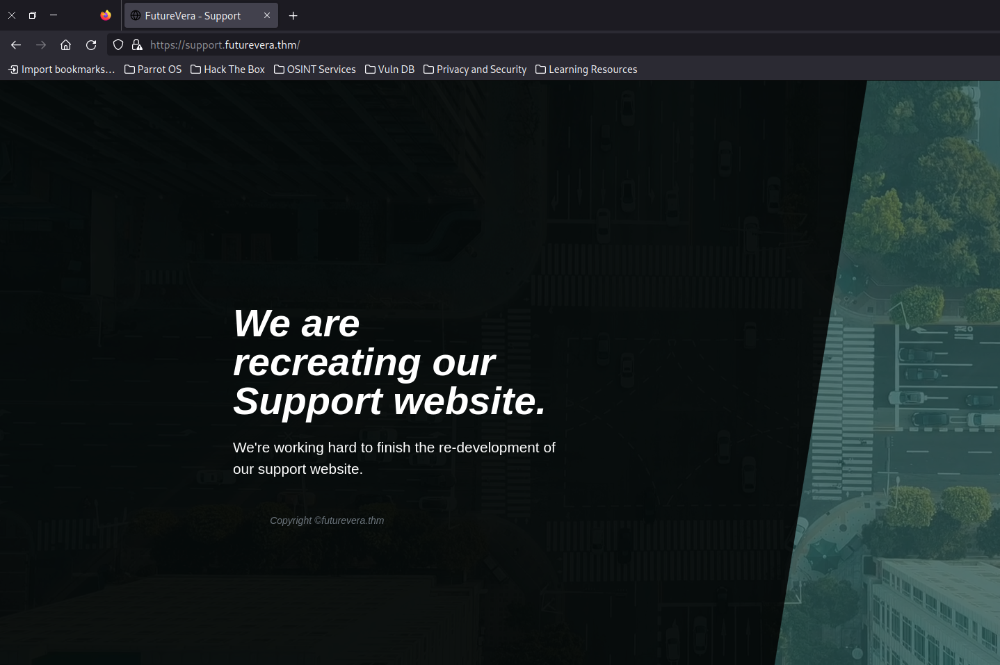

[[Writeups]]
Vamos con la maquina takeover de tryhackme, os muestro el enunciado que nos da la web antes de empezar la maquina:

Hello there,  
  
I am the CEO and one of the co-founders of futurevera.thm. In Futurevera, we believe that the future is in space. We do a lot of space research and write blogs about it. We used to help students with space questions, but we are rebuilding our support.  

Recently blackhat hackers approached us saying they could takeover and are asking us for a big ransom. Please help us to find what they can takeover.  
  
Our website is located at [https://futurevera.thm](https://futurevera.thm/)

Hint: Don't forget to add the MACHINE_IP in /etc/hosts for futurevera.thm ; )

Answer the questions below

**What's the value of the flag?**

-----


Empezamos escaneando todos los puertos con un nmap :

``` bash
❯ nmap -p- --min-rate 5000 10.10.65.215
Starting Nmap 7.94SVN ( https://nmap.org ) at 2024-05-13 15:29 CEST
Nmap scan report for 10.10.65.215
Host is up (0.053s latency).
Not shown: 65532 closed tcp ports (conn-refused)
PORT    STATE SERVICE
22/tcp  open  ssh
80/tcp  open  http
443/tcp open  https

Nmap done: 1 IP address (1 host up) scanned in 13.38 seconds

```

Y hacemos el escaneo mas profundo para cada puerto:

``` bash
❯ nmap -p22,80,443 -sCV 10.10.65.215
Starting Nmap 7.94SVN ( https://nmap.org ) at 2024-05-13 15:31 CEST
Nmap scan report for 10.10.65.215
Host is up (0.17s latency).

PORT    STATE SERVICE  VERSION
22/tcp  open  ssh      OpenSSH 8.2p1 Ubuntu 4ubuntu0.4 (Ubuntu Linux; protocol 2.0)
| ssh-hostkey: 
|   3072 dd:29:a7:0c:05:69:1f:f6:26:0a:d9:28:cd:40:f0:20 (RSA)
|   256 cb:2e:a8:6d:03:66:e9:70:eb:96:e1:f5:ba:25:cb:4e (ECDSA)
|_  256 50:d3:4b:a8:a2:4d:1d:79:e1:7d:ac:bb:ff:0b:24:13 (ED25519)
80/tcp  open  http     Apache httpd 2.4.41 ((Ubuntu))
|_http-title: Did not follow redirect to https://futurevera.thm/
|_http-server-header: Apache/2.4.41 (Ubuntu)
443/tcp open  ssl/http Apache httpd 2.4.41 ((Ubuntu))
| tls-alpn: 
|_  http/1.1
| ssl-cert: Subject: commonName=futurevera.thm/organizationName=Futurevera/stateOrProvinceName=Oregon/countryName=US
| Not valid before: 2022-03-13T10:05:19
|_Not valid after:  2023-03-13T10:05:19
|_http-title: FutureVera
|_http-server-header: Apache/2.4.41 (Ubuntu)
|_ssl-date: TLS randomness does not represent time
Service Info: OS: Linux; CPE: cpe:/o:linux:linux_kernel

Service detection performed. Please report any incorrect results at https://nmap.org/submit/ .
Nmap done: 1 IP address (1 host up) scanned in 17.89 seconds
```

Con esto, vamos a ver la web, de primeras tendremos que hacer un cambio en nuestro hosts para poder visualizar la web:

``` bash
❯ sudo nano /etc/hosts
# añadimos la ip y la web de futureva en el hosts para hacer la redireccion, asi se ve mi hosts:

# Host addresses
127.0.0.1  localhost
127.0.1.1  parrot
::1        localhost ip6-localhost ip6-loopback
ff02::1    ip6-allnodes
ff02::2    ip6-allrouters

# Others

10.10.65.215 futurevera.thm

```

Tras enumerar y probar la web sin ninguna pista iniciamos una búsqueda para los subdominios y encontre esto:

``` bash
wfuzz -c --hc=403 --hw=329 -t 20 -w /usr/share/SecLists/Discovery/DNS/subdomains-top1million-5000.txt -H "Host: FUZZ.futurevera.thm" -u https://futurevera.thm

 /usr/lib/python3/dist-packages/wfuzz/__init__.py:34: UserWarning:Pycurl is not compiled against Openssl. Wfuzz might not work correctly when fuzzing SSL sites. Check Wfuzzs documentation for more information.
********************************************************
* Wfuzz 3.1.0 - The Web Fuzzer                         *
********************************************************

Target: https://futurevera.thm/
Total requests: 4989

=====================================================================
ID           Response   Lines    Word       Chars       Payload                                                                                                                      
=====================================================================

000000034:   421        12 L     49 W       411 Ch      "support"                                                                                                                    
000000018:   421        12 L     49 W       408 Ch      "blog"                                                                                                                       

Total time: 16.04171
Processed Requests: 4989
Filtered Requests: 4987
Requests/sec.: 311.0017

```
 
 usando la herramienta wfuzz quitamos los codigos 403 y quitamos las paginas que nos den un numero de palabras diferente a 329 ya que parece un mesaje generico que da en todas las busquedas y nos quedan dos webs, support y blog, tienen un codigo 421 porque seguramente los tengamos que añadir al hosts para poder acceder a estas paginas, vamos primero con support.
 
antes añadimos las webs al hosts:

``` bash
❯ sudo nano /etc/hosts

# Others

10.10.65.215 futurevera.thm
10.10.65.215 support.futurevera.thm
10.10.65.215 blog.futurevera.th
```

 y vamos a ver el subdominio support:


aqui para ver la flag tendremos que buscar en los certificados de la web, para eso en firefox a la izquierda de la url en el candado podremos entras a las opciones para visualizar el certificado y encontraremos algo raro:


encontramos otro subdominio: secrethelpdesk934752.support.futurevera.thm
asi que lo añadimos al host y veos que hay en este subdominio:


la web no tiene nada para sacar en si, pero al acceder con http en vez de https obtendremos la flag:

**flag{beea0d6edfcee06a59b83fb50ae81b2f}**

y con esto concluimos la maquina.


